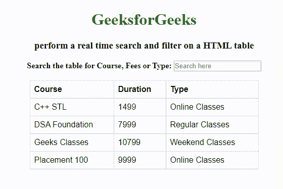

# 如何对一个 HTML 表格进行实时搜索和过滤？

> 原文:[https://www . geesforgeks . org/如何在 html 表格上执行实时搜索和过滤/](https://www.geeksforgeeks.org/how-to-perform-a-real-time-search-and-filter-on-a-html-table/)

在这里，我们学习如何对一个 HTML 表执行实时搜索和过滤。当输入一个单词时，将搜索表格的所有行(表格标题除外)，并显示包含匹配单词的行。为此，我们可以使用 JQuery 方法。

*   **[filter():](https://www.geeksforgeeks.org/jquery-filter/)** 此方法用于过滤掉所有与所选条件不匹配的元素，那些匹配的元素将被返回。将匹配的元素集合减少到那些匹配选择器或通过函数测试的元素。
*   **[切换():](https://www.geeksforgeeks.org/jquery-toggle-method/)** 此方法用于检查所选元素的可见性，以在所选元素的 hide()和 show()之间切换。显示或隐藏匹配的元素。

在下面的示例中，搜索框中输入的搜索值存储在名为“value”的变量中，并被转换为小写，因为我们正在执行不区分大小写的搜索。之后，我们使用 **filter()** 函数搜索表中的每一行，并显示变量“value”中存储的字符串所在的行。**切换()**方法用于显示包含搜索词的行并隐藏其他行。如果在该行中找不到该词，**索引(值)**将返回-1。

**示例:**下面的示例说明了如何使用 filter()和 toggle()函数对 HTML 表执行实时搜索和过滤。

```html
<!DOCTYPE html>
<html>

<head>
    <script src=
"https://ajax.googleapis.com/ajax/libs/jquery/3.4.1/jquery.min.js">
    </script>

    <style>
        table {
            font-family: arial, sans-serif;
            border-collapse: collapse;
            width: 50%;
        }

        td,
        th {
            border: 1px solid #dddddd;
            text-align: left;
            padding: 8px;
        }

        h1 {
            color: green;
        }
    </style>
</head>

<body>
    <center>
        <h1>GeeksforGeeks</h1>
        <h3>
          perform a real time search and filter 
          on a HTML table
        </h3>
        <b>Search the table for Course, Fees or Type: 
          <input id="gfg" type="text" 
                 placeholder="Search here">
        </b>
        <br>
        <br>
        <table>
            <tr>
                <th>Course</th>
                <th>Duration</th>
                <th>Type</th>
            </tr>
            <tbody id="geeks">
                <tr>
                    <td>C++ STL</td>
                    <td>1499</td>
                    <td>Online Classes
                    </td>
                </tr>
                <tr>
                    <td>DSA Foundation</td>
                    <td>7999</td>
                    <td>Regular Classes</td>
                </tr>
                <tr>
                    <td>Geeks Classes</td>
                    <td>10799</td>
                    <td>Weekend Classes</td>
                </tr>
                <tr>
                    <td>Placement 100</td>
                    <td>9999</td>
                    <td>Online Classes</td>
                </tr>
            </tbody>
        </table>

        <script>
            $(document).ready(function() {
                $("#gfg").on("keyup", function() {
                    var value = $(this).val().toLowerCase();
                    $("#geeks tr").filter(function() {
                        $(this).toggle($(this).text()
                        .toLowerCase().indexOf(value) > -1)
                    });
                });
            });
        </script>
  </center>

</body>

</html>
```

**输出:**
