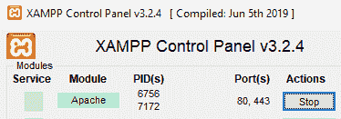
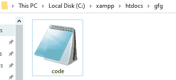
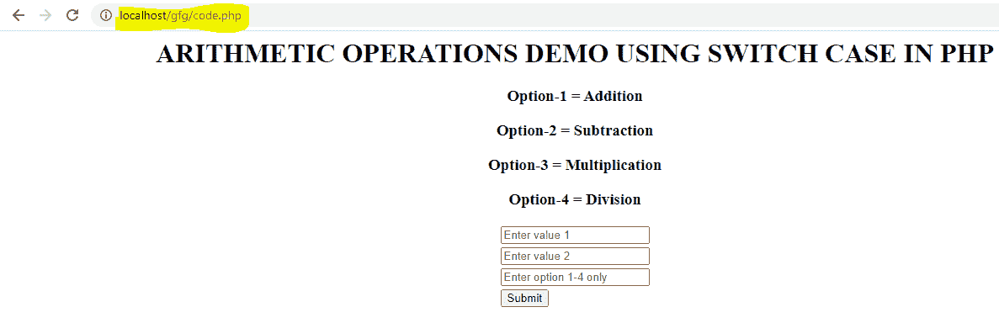
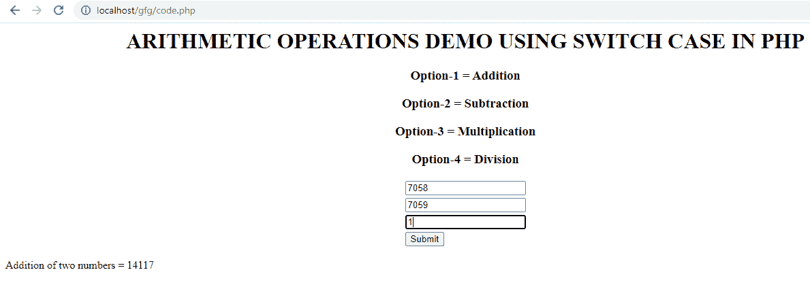
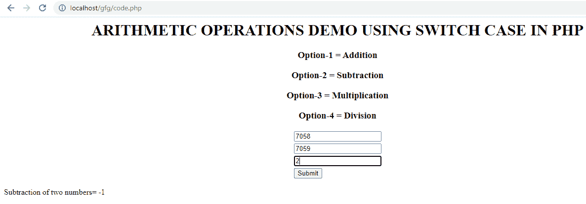
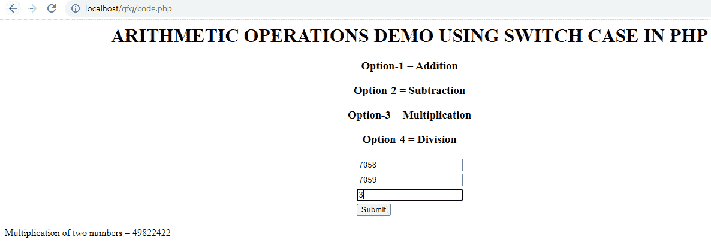
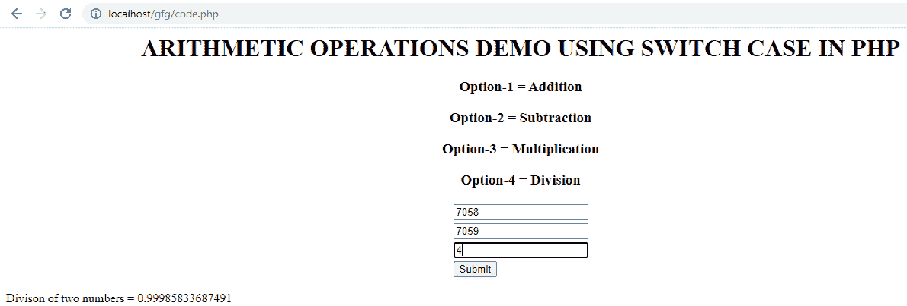

# 如何通过 HTML 形式在 PHP 中使用 Switch Case 进行算术运算？

> 原文:[https://www . geeksforgeeks . org/如何通过 html-form/使用 php 中的开关执行算术运算/](https://www.geeksforgeeks.org/how-to-perform-arithmetic-operation-using-switch-case-in-php-through-html-form/)

我们将使用 PHP 执行基本的算术运算，如加法、减法、乘法和除法。我们使用 HTML 表单来获取输入值，并选择一个选项来使用开关盒执行特定的操作。

算术运算用于执行加法、减法等运算。关于价值观。要对数据进行算术运算，我们至少需要两个值。

*   **加法:**执行给定数字的和。
*   **减法:**执行给定数字的差。
*   **乘法:**执行给定数字的乘法运算。
*   **除法:**执行给定数字的除法*。*

**示例:**

```html
Addition = val + val2 + ... + valn
Example: add = 4 + 4 = 8

Subtraction = val - val2 - ... - valn
Example: sub = 4 - 4 = 0

Multiplication = val1 * val2 * ... * valn
Example: mul = 4 * 4 = 16

Division = val1 / val2
Example: mul = 4 / 4 = 1
```

**程序 1:**

## 服务器端编程语言（Professional Hypertext Preprocessor 的缩写）

```html
<?php 

$x = 15;
$y = 30;

$add = $x + $y; 
$sub = $x - $y;
$mul = $x * $y;
$div = $y / $x; 

echo "Sum: " . $add . "\n";
echo "Diff: " . $sub . "\n";
echo "Mul: " . $mul . "\n";
echo "Div: " . $div;

?>
```

**输出:**

```html
Sum: 45
Diff: -15
Mul: 450
Div: 2
```

**使用 Switch Case:**Switch 语句用于根据不同的条件执行不同的动作。

**语法:**

```html
switch (n) {
    case label1:
        code to be executed if n=label1;
        break;
    case label2:
        code to be executed if n=label2;
        break;
    case label3:
        code to be executed if n=label3;
        break;

    . . .

    case labeln:
        code to be executed if n=labellast;
        break;
    default:
        code to be executed if n is different from all labels;
}
```

**执行步骤:**

*   启动 XAMPP 服务器



*   打开记事本，输入下面的代码，将文件夹保存在图像
    给出的路径中



**程序 2:**

## 服务器端编程语言（Professional Hypertext Preprocessor 的缩写）

```html
<!DOCTYPE html>
<html>
<head>
    <title>GFG</title>
</head>

<body><center>
    <h1>
        ARITHMETIC OPERATIONS DEMO USING
        SWITCH CASE IN PHP
    </h1>

    <h3>Option-1 = Addition</h3>
    <h3>Option-2 = Subtraction</h3>
    <h3>Option-3 = Multiplication</h3>
    <h3>Option-4 = Division</h3>

    <form method="post">
        <table border="0">
            <tr>
                <!-- Taking value 1 in an text box -->
                <td> <input type="text" name="num1"
                    value="" placeholder="Enter value 1"/>
                </td>
            </tr>

            <tr>
            <!-- Taking value 1 in an text box -->
            <td> <input type="text" name="num2" value=""
                    placeholder="Enter value 2"/>
                </td>
            </tr>

            <tr>
                <!-- Taking option in an text box -->
                <td> <input type="text" name="option" value=""
                    placeholder="Enter option 1-4 only"/>
                </td>
            </tr>

            <tr>
                <td> <input type="submit" name="submit"
                    value="Submit"/>
                </td>
            </tr>
        </table>
    </form>
</center>

<?php

// Checking submit condition
if(isset($_POST['submit'])) {

    // Taking first number from the
    // form data to variable 'a'
    $a = $_POST['num1'];

    // Taking second number from the
    // form data to a variable 'b'
    $b = $_POST['num2'];

    // Taking option from the form
    // data to a variable 'ch'
    $ch = $_POST['option'];

    switch($ch) {
        case 1:

            // Execute addition operation
            // when option 1 is given
            $r = $a + $b;
            echo " Addition of two numbers = " . $r ;
            break;

        case 2:

            // Executing subtraction operation
            // when option 2 is given
            $r = $a - $b;
            echo " Subtraction  of two numbers= " . $r ;
            break;

        case 3:

            // Executing multiplication operation
            // when option 3 is given
            $r = $a * $b;
            echo " Multiplication of two numbers = " . $r ;
            break;

        case 4:

            // Executing division operation
            // when option 4 is given
            $r = $a / $b;
            echo " Division of two numbers = " . $r ;
            break;

        default:

            // When 1 to 4 option is not given
            // then this condition is executed
            echo ("invalid option\n");
    }

    return 0;
}
?>
</body>
</html>
```

**输出:**打开 Web 浏览器，输入***<u>localhost/gfg/code . PHP</u>***





添加



减法



增加



分开