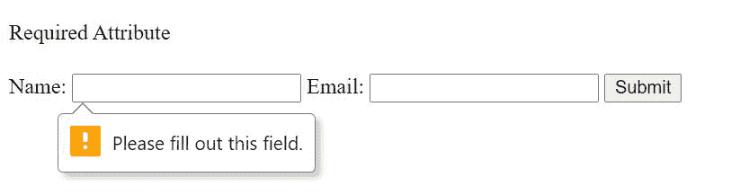
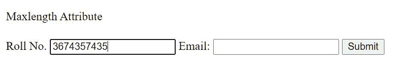
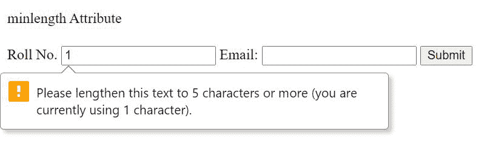
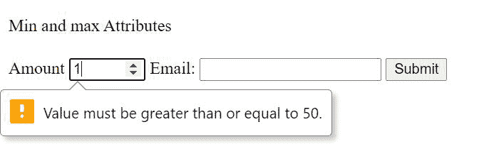
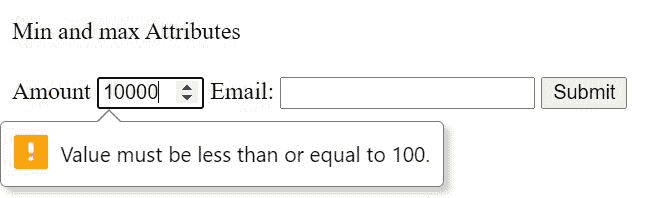
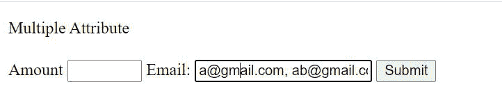
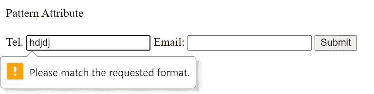

# 如何对 HTML 中的必填字段进行表单验证？

> 原文:[https://www . geeksforgeeks . org/如何对 html 中的必填字段执行表单验证/](https://www.geeksforgeeks.org/how-to-perform-form-validation-for-a-required-field-in-html/)

表单数据对于网站来说非常重要，正确的表单数据或有效的表单数据必须提交到表单中。为了确保表单数据有效或强制输入字段，可以使用各种属性。我们将在本文中讨论以下属性&将通过示例的帮助来理解。

*   需要
*   最大长
*   明伦格特
*   最小值和最大值
*   多重
*   模式

让我们通过例子逐一讨论所有要点。

**1。必需属性:**如果您想强制用户输入，可以使用必需属性。该属性可用于任何输入类型，如电子邮件、网址、文本、文件、密码、复选框、单选按钮等。这有助于强制任何输入字段。

**语法:**

```html
<input type="..." id="..." name="..." required>
```

**示例:**

## 超文本标记语言

```html
<!DOCTYPE html>
<html lang="en">

<body>
    <p>Required Attribute</p>

    <form>
        <label>Name:</label>
        <input type="text" required />
        <label>Email:</label>
        <input type="email" required />
        <button style="margin-top: 5px">Submit</button>
    </form>
</body>

</html>
```

**输出:**



**2。Maxlength 属性:**maxlength 属性帮助我们指定表单中输入字段的最大长度，即可以为特定字段输入的最大字符数。它可用于使印度电话号码的最大长度为 10 位数字，以防止任何错误的输入数据提交。

**语法:**

```html
<input type="..." id="..." name="..." maxlength="...">
```

**注意:**设置 maxlength 属性时，不允许用户输入超过指定的字符。

**示例:**

## 超文本标记语言

```html
<!DOCTYPE html>
<html lang="en">

<body>
    <p>Maxlength Attribute</p>

    <form>
        <label>Roll No.</label>
        <input type="text" maxlength="10" required />
        <label>Email:</label>
        <input type="email" required />
        <button style="margin-top: 5px">Submit</button>
    </form>
</body>

</html>
```

**输出:**



**3。最小长度属性:**最小长度属性帮助我们指定表单中输入字段的最小长度，即特定字段必须输入的最小字符数。将不能被猜到的密码或印度的电话号码的最小长度定为 10 位是有用的，以防止任何错误的输入数据提交。

**语法:**

```html
<input type="..." id="..." name="..." minlength="...">
```

**注意:**设置 minlength 属性时，输入字段不接受少于指定的字符。

**示例:**

## 超文本标记语言

```html
<!DOCTYPE html>
<html lang="en">

<body>
    <p>minlength Attribute</p>

    <form>
        <label>Roll No.</label>
        <input type="text" minlength="5" required />
        <label>Email:</label>
        <input type="email" required />
        <button style="margin-top: 5px">Submit</button>
    </form>
</body>

</html>
```

**输出:**



**4。最小和最大属性:**输入字段的最小和最大属性用于指定输入字段的最小和最大允许值。我们可以使用最小值和最大值一起创建一个允许值的范围。

最小值指定输入字段可以具有的最小值，而最大值指定字段的最大值。

最小值和最大值属性用于各种输入类型，如数字、范围、日期、日期时间、月份、时间和星期。我们可以在希望用户输入一些金额的字段中使用这些属性。我们可以为要输入的金额设置最大限额和最小限额。

**语法:**

```html
<input type="..." id="..." name="..." max="...">
<input type="..." id="..." name="..." min="..." max="...">
```

**示例:**

## 超文本标记语言

```html
<!DOCTYPE html>
<html lang="en">

<body>
    <p>Min and max Attributes</p>

    <form>
        <label>Amount</label>
        <input type="number" min="50" max="100" required />
        <label>Email:</label>
        <input type="email" required />
        <button style="margin-top: 5px">Submit</button>
    </form>
</body>

</html>
```

**输出:**

 

**5。多属性:**多属性可以帮助我们允许用户在单个输入字段中输入多个值。多重属性只能用于电子邮件和文件输入类型。

**语法:**

```html
<input type="..." id="..." name="...." multiple>
```

**示例:**

## 超文本标记语言

```html
<!DOCTYPE html>
<html lang="en">

<body>
    <p>Multiple Attribute</p>

    <form>
        <label>Amount</label>
        <input type="number" min="50" max="100" required />
        <label>Email:</label>
        <input type="email" multiple required />
        <button style="margin-top: 5px">Submit</button>
    </form>
</body>

</html>
```

**输出:**



**6。模式属性:**模式属性定义了提交表单时输入字段的值必须满足的特定模式。模式属性适用于文本、日期、搜索、网址、电话、电子邮件和密码输入类型。我们使用正则表达式[来指定模式。这在我们希望输入必须只根据给定模式的情况下很有用。不满足模式的输入将不会被表单接受。](https://www.geeksforgeeks.org/write-regular-expressions/)

**语法:**

```html
<input type="...." id="..." name="...." pattern=".....">
```

**示例:**

## 超文本标记语言

```html
<!DOCTYPE html>
<html lang="en">

<body>
    <p>Pattern Attribute</p>

    <form>
        <label>Tel.</label>
        <input type="text" pattern="[0-9]{10}" required />
        <label>Email:</label>
        <input type="email" multiple required />
        <button style="margin-top: 5px">Submit</button>
    </form>
</body>

</html>
```

**输出:**



在上面的例子中，模式指定 Tel。只能由数字组成，长度必须为 10。

这就是我们如何使表单数据成为必需的，或者在输入的输入上添加某些检查。