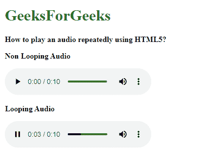

# 如何使用 HTML5 反复播放音频？

> 原文:[https://www . geesforgeks . org/如何播放音频-重复使用-html5/](https://www.geeksforgeeks.org/how-to-play-audio-repeatedly-using-html5/)

本文将向您展示如何在网页上重复播放音频文件。这是通过使用 **[<音频>标签](https://www.geeksforgeeks.org/html5-audio/)** 的**循环**属性来完成的。用于加载网页后反复重启音频。这可以在音频必须循环直到它被特别停止的情况下使用，例如在网页上的背景音乐的情况下。

**语法:**

```html
<audio loop>
```

**示例:**

## 超文本标记语言

```html
<!DOCTYPE html>
<html>

<head>
    <title>
        How to play an audio repeatedly
        using HTML5?
    </title>
</head>

<body>
    <h1 style="color: green;">
        GeeksForGeeks
    </h1>
    <b>
        How to play an audio repeatedly
        using HTML5?
    </b>

    <p><b>Non Looping Audio</b></p>

    <audio controls>
        <source src=
"https://media.geeksforgeeks.org/wp-content/uploads/20190625153922/frog.mp3"
        type="audio/mp3">
    </audio>

    <p><b>Looping Audio</b></p>

    <!-- Using the loop attribute -->
    <audio controls loop>
        <source src=
"https://media.geeksforgeeks.org/wp-content/uploads/20190625153922/frog.mp3"
        type="audio/mp3">
    </audio>
</body>

</html>
```

**输出:**



**支持的浏览器:**

*   谷歌 Chrome 4.0
*   Internet Explorer 9.0
*   Firefox 3.5
*   歌剧 10.5
*   Safari 4.0