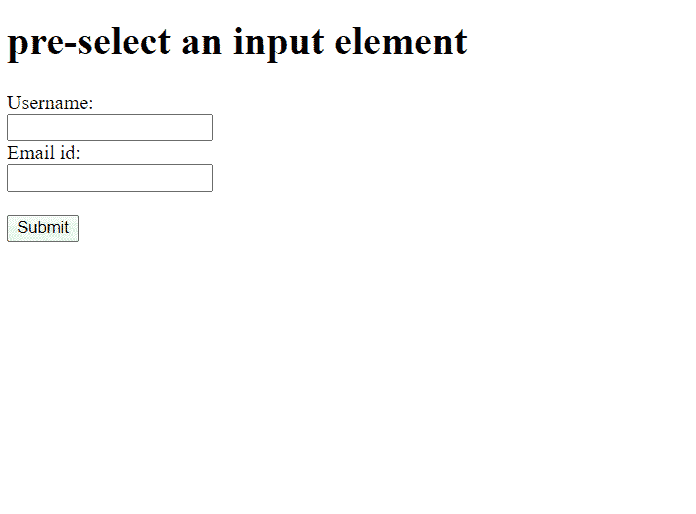

# 在 HTML5 中加载页面时，如何预选输入元素？

> 原文:[https://www . geesforgeks . org/如何在页面加载 html5 时预先选择输入元素/](https://www.geeksforgeeks.org/how-to-pre-select-an-input-element-when-the-page-loads-in-html5/)

在本文中，我们将在页面加载时预先选择一个输入元素，即用户不必点击第一个文本框就可以开始在上面书写。当页面被加载时，输入将被预先选择，用户可以直接开始键入。这可以通过使用[自动对焦](https://www.geeksforgeeks.org/html-input-autofocus-attribute/)属性来完成。它是一个布尔属性，用于聚焦元素，支持<按钮>、<输入>、<选择>和<文本区>元素。

**进场:**

*   为 HTML 表单创建一个 [div](https://www.geeksforgeeks.org/div-tag-html/) 。
*   我们将在一种类型文本的形式中制作输入元素，并将[自动对焦](https://www.geeksforgeeks.org/html-input-autofocus-attribute/)添加到用户名中。
*   在页面加载时，我们会看到用户名将处于焦点，我们可以直接开始键入。

**语法**T2:

```html
<input type="text" autofocus>
```

**示例:**

## 超文本标记语言

```html
<!DOCTYPE html> 
<html lang="en"> 
<body> 
    <h1>  pre-select an input element  </h1> 
    <form> 
          <label>Username:</label><br> 
          <input type="text" name="username" autofocus> 
          <br> 
          <label>Email id:</label><br> 
          <input type="text" name="email_id"> 
          <br><br> 
          <input type="submit" value="Submit"> 
</form>  
</body> 
</html>
```

**输出:**



预选输入元素