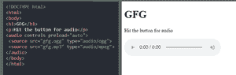
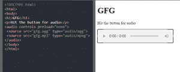

# 如何在 HTML5 中预加载一个音频？

> 原文:[https://www . geesforgeks . org/如何预加载 html5 中的音频/](https://www.geeksforgeeks.org/how-to-preload-an-audio-in-html5/)

在本文中，我们将用 HTML 预加载音频。我们使用 preload =“auto”属性来预加载音频文件。HTML strong 音频预加载属性用于指定页面加载时作者认为应该如何加载音频。音频预载属性允许作者向浏览器指示应该如何实现网站的用户体验。在某些情况下，这个属性可以忽略。

你要知道 [HTML <音频>预加载属性](https://www.geeksforgeeks.org/html-audio-preload-attribute/)

**注意:**如果**自动播放**存在，则*预载*属性被忽略。

以下是说明使用*预加载*属性的示例。

**示例-1:** 当*预载* =“自动”时

## 超文本标记语言

```html
<!DOCTYPE html>
<html>
<body>
  <h1>GFG</h1>
  <p>Hit the button for audio</p>
  <audio controls preload="auto">
     <source src="gfg.ogg" type="audio/ogg">
     <source src="gfg.mp3" type="audio/mpeg">
  </audio>
</body>

</html>
```

**输出:**



例 1

**示例 2:** 预加载时=“无”:

## 超文本标记语言

```html
<!DOCTYPE html>
<html>

<body>
  <h1>GFG</h1>
  <p>Hit the button for audio</p>

  <audio controls preload="none">
     <source src="gfg.ogg" type="audio/ogg">
     <source src="gfg.mp3" type="audio/mpeg">
  </audio>
</body>

</html>
```

**输出:**



例 2