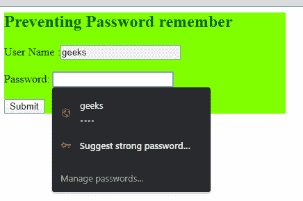
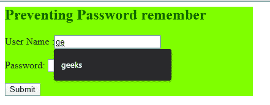
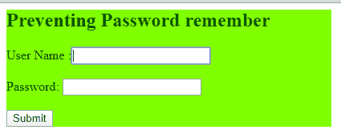
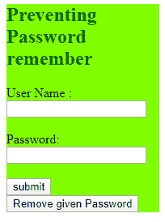
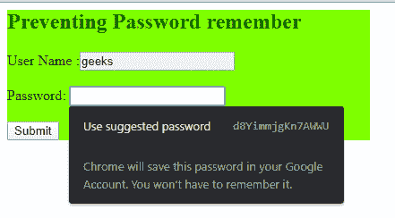

# 如何防止浏览器在 HTML 中记住密码？

> 原文:[https://www . geesforgeks . org/如何防止浏览器在 html 中记住密码/](https://www.geeksforgeeks.org/how-to-prevent-browser-to-remember-password-in-html/)

当我们第一次在浏览器中使用某个特定网站时，浏览器会记住通过网站上的 *<输入*字段提交的信息。因此，另一次当我们再次通过该浏览器在该网站上提交数据时，在该字段中会有一个提交值的建议列表。在许多情况下，这可能会造成安全问题。

**方法 1:** 已知方法之一是使用*自动完成*属性，防止浏览器记住密码。在*输入*字段中，如果我们定义*自动完成=“关闭”*，那么很多时候浏览器不会记住输入值。

**语法:**

```html
<input type = "password" autocomplete="off">
```

**示例:**在很多情况下，如果我们不使用*自动完成=“关”*属性，那么浏览器会给我们输入字段的建议，如下图


这是为密码字段，但我们也得到除密码以外的其他字段的建议。，如下图所示，


要防止这种事情发生，请使用*自动完成=“off”*属性。参见下面的代码，

**例 1:**

```html
<!DOCTYPE html>
<html>

<body>
    <div style="background-color: 
        #7fff00; width: 30%;">

        <h2 style="color: #006400;">
            Preventing Password remember
        </h2>

        <!-- autocomplete = "off" it causes for
            allover the form where input 
            fields are used -->
        <form name="Frm" autocomplete="off">

            User Name :<input id="username" 
                type="text" name="userName" />
            <br /><br />

            Password: <input id="password" 
                type="password" name="passWord" />
            <br /><br />

            <input id="uname" type="submit" />
        </form>
    </div>
</body>

</html>
```

**输出:**

现在，没有给出字段的建议。

在许多现代浏览器中，这个属性没有任何作用。因此，在这种情况下，如果我们在输入字段下再使用一个东西，那么这个问题就可以解决了。

> <input type="”password”" autocomplete="”off”" readonly="readonly" onclick="”this.removeAttribute(‘readonly’);”">

这里， *readonly* 属性设置或返回一个布尔值，如果该字段是只读的，或者不是，只读字段不能被修改。

**例 2:**

```html
<!DOCTYPE html>
<html>

<body>
    <div style="background-color: 
        #7fff00; width: 30%;">

        <h2 style="color: #006400;">
            Preventing Password remember
        </h2>

        <form name="Frm">
            User Name :<input id="username" 
                type="text" name="userName" 
                autocomplete="off" readonly
                onclick="this.removeAttribute(
                    'readOnly');" />
            <br /><br />

            Password: <input id="password" 
                type="password" name="passWord" 
                autocomplete="off" readonly
                onclick="this.removeAttribute(
                    'readOnly');" />
            <br /><br />

            <!--"removeAttribute()" method 
                removes the specified attribute
                from an element-->
            <input id="uname" type="submit" />
        </form>
    </div>
</body>

</html>
```

**输出:**


**方法 2:** 现在我们可以使用另一种方法从表单中删除密码和其他值。这些值以 cookie 的形式存储在浏览器中，因此如果 cookie 被删除，那么密码以及其他值也会被删除。所以我们只需要添加一个函数来删除 cookies。
T3】例:

```html
<html>

<head>
    <script type="text/javascript">
        function savePass() {
            passVal = "password = "
                + escape(document.Frm.passWord.value)
                + ";";

            document.cookie = passVal
                + "expires = Sun, 01-May-2021 14:00:00 GMT";

            document.getElementById("show").innerHTML =
                "Password saved, " + document.cookie;
        }
        function dltPass() {
            document.cookie = passVal
                + "expires = Sun, 01-May-2019 14:00:00 GMT";
                // Set the expiration date to 
                // removes the saved password

            document.getElementById("show").innerHTML =
                "Password deleted!!!";
            // Removes the passeord from the browser

            document.getElementById("pass").value = "";
            // Removes the passeord from the input box
        }
    </script>
</head>

<body>
    <div style="background-color: #7fff00; width: 30%;">
        <h2 style="color: #006400;">
            Preventing Password remember
        </h2>

        <form name="Frm">
            User Name :<input id="username" 
                type="text" name="userName" />
            <br /><br />

            Password: <input id="pass" 
                type="password" name="passWord" />
            <br /><br />

            <input id="uname" type="button" 
                value="submit" onclick="savePass();" />

            <input id="remove" type="button"
                value="Remove given Password" 
                onclick="dltPass();" />

            <p id="show"></p>
        </form>
    </div>
</body>

</html>
```

**输出:**


**方法三:**防止浏览器记住密码的另一种方法是，使用*自动完成=“新密码”*，此时浏览器会给出随机密码建议，同时以任意形式填写密码字段。所以实际密码不会保存在浏览器中。浏览器隐藏了实际密码，并一直显示兰德建议。

```html
<input type = "password" autocomplete="new-password">
```

**示例:**

```html
<html>

<body>
    <div style="background-color: #7fff00;
                    width: 30%;">
        <h2 style="color: #006400;">
            Preventing Password remember
        </h2>

        <form name="Frm">
            User Name :<input id="username" 
                type="text" name="userName" />
            <br /><br />

            Password: <input id="password" 
                type="password" name="passWord" 
                autocomplete="new-password" />
            <br /><br />

            <!--used autocomplete="new-password" -->
            <input id="uname" type="submit" />
        </form>
    </div>
</body>

</html>
```

**输出:**
