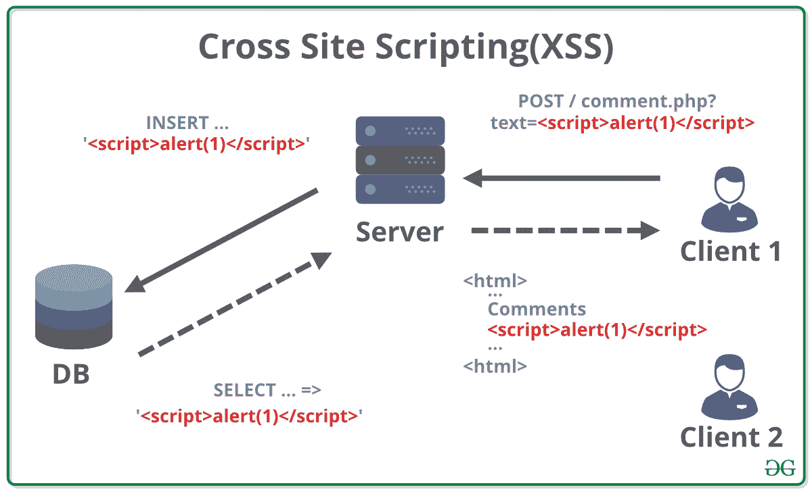

# 如何用 HTML/PHP 防 XSS？

> 原文:[https://www . geeksforgeeks . org/如何防止-xss-with-html-php/](https://www.geeksforgeeks.org/how-to-prevent-xss-with-html-php/)

[**【跨站点脚本】**](https://www.geeksforgeeks.org/what-is-cross-site-scripting-xss/) 或 **XSS** 是一种安全漏洞，攻击者获得对网站的访问权限，并在客户端执行潜在的恶意脚本。这是代码注入攻击之一，可能是由于错误地验证用户数据引起的，这些数据通常是通过 web 表单或使用已被篡改的超链接插入到页面中的。这段代码可以通过任何客户端编码语言插入，比如 JavaScript、HTML、PHP、VBScript。

**为什么会发生？**
跨站点脚本或 XSS 攻击的发生主要是由于服务器端开发人员没有交付安全代码。因此，每个程序员都有责任提供一个安全代码，使攻击者很难利用可能的安全漏洞。



**攻击者可以用 XSS 完成什么？**
XSS 漏洞可被攻击者用来实现一系列潜在的邪恶目标，例如–

*   **窃取‘会话标识符’–**通过窃取一个人的会话 id，攻击者可以冒充我们并访问应用程序。这可能导致未经授权的人访问潜在的数据。
*   **URL 重定向–**URL 重定向是将用户重定向到另一个恶意钓鱼页面以收集敏感信息的行为。
*   **运行不需要的软件–**攻击者还可以在我们的计算机和其他设备上安装恶意软件。这种恶意软件会对设备上的数据造成损害。

**在 HTML 和 PHP 中防止 XSS**
以下是我们在网络应用程序中防止 XSS 的方法–

*   **使用 htmlspecialchars()函数–**HTML specialchars()函数将特殊字符转换为 HTML 实体。对于大多数网络应用程序，我们可以使用这种方法，这是最流行的防止 XSS 的方法之一。这个过程也被称为 HTML 转义。
    *   & '(和号)变成' & '
    *   “'(双引号)变成了“”
    *   “(大于)变成“>”
*   **htmlentities()–**htmlentities()也执行与 htmlspecialchars()相同的任务，但是这个函数覆盖了更多的字符实体。使用此功能还可能导致过度编码，并可能导致某些内容显示不正确。
*   **strip _ tags()–**此功能删除 HTML 标签之间的内容。此功能也不会过滤或编码非配对的闭合角撑。
*   **addslashes()–**addslashes()函数添加一个斜杠字符，试图阻止攻击者终止变量赋值并在末尾添加可执行代码。
*   **内容安全策略(CSP)–**CSP 是我们选择防御 XSS 攻击的最后选择。CSP 的使用限制了攻击者的行动。我们的浏览器执行它从服务器接收的所有 JavaScript，无论它们是来自内部还是外部。当涉及到 HTML 文档时，浏览器无法确定资源是否是恶意的。CSP 是一个 HTTP 头，它将一组受信任的资源源列入白名单，浏览器可以使用这些资源来确定对传入资源的信任。

```html
X-Content-Security-Policy: script-src 'self'
```

*   上面一行暗示浏览器只信任引用当前域的源 URL。浏览器将仅从该来源获取资源的所有输入，其他所有输入都将被忽略。
    我们可以添加很多资源指令。下面给出了其中的一些–
    *   **connect-src:** 限制可以使用 XMLHttpRequest、WebSocket 等连接的信号源。
    *   **字体-src:** 限制网页字体的来源。frame-src:限制可以作为框架嵌入页面的源 URL。
    *   **img-src:** 限制图像的来源。媒体-src:限制视频和音频的来源。
    *   **对象-src:** 限制 Flash 和其他插件的来源。脚本-src:限制脚本文件的来源。
    *   **样式-src:** 限制 CSS 文件的来源。
*   **第三方 PHP 库–**也有一些第三方 PHP 库帮助预防 XSS。下面列出了其中一些–
    1.  htmLawed
    2.  PHP 反 XSS
    3.  超文本标记语言净化器

**结论:**作为一个指导原则，我们应该尽量不要插入用户控制的数据，除非它是应用程序运行所明确需要的。注释是最好的例子，用户可以输入恶意的 XSS 脚本。这通常被视为对应用程序没有任何功能作用，但也会引入一些严重的安全漏洞。