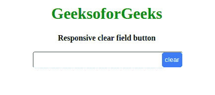
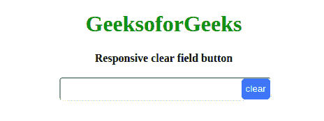

# 如何在 HTML 输入文本字段内放置一个响应清晰的按钮？

> 原文:[https://www . geeksforgeeks . org/如何在 html 输入文本字段中输入响应清除按钮/](https://www.geeksforgeeks.org/how-to-put-a-responsive-clear-button-inside-html-input-text-field/)



输入字段内的响应按钮将清除点击事件上的文本区域。在本文中，我们将讨论如何使用 HTML、CSS 和 JavaScript 在 HTML 输入字段中放置一个响应明确的按钮。为了将按钮放在输入字段中，我们将使用 CSS。让我们先看看 HTML。
**创建结构:**在本节中，我们将为输入字段创建基本结构。

*   **HTML 代码:**通过使用 HTML，我们将输入字段放置在我们将添加响应按钮来清除字段的地方。我们创建一个**文本字段**和一个**按钮**，并将它们放置在**同一个分区**中。为了使按钮适合输入文本字段，需要以下 css。

## 超文本标记语言

```html
<!DOCTYPE html>
<html lang="en">

<head>
    <meta charset="UTF-8">
    <meta name="viewport" 
          content="width=device-width, initial-scale=1.0">
    <title>Responsive clear field button</title>
</head>

<body>
    <h1>GeeksoforGeeks</h1>
    <b>Responsive clear field button</b>
    <br><br>
    <div class="buttonIn">
        <input type="text" id="enter">
        <button id="clear">clear</button>
    </div>
</body>

</html>
```

**设计结构:**在本节中，我们将设计结构，使其具有吸引力或意义。

*   **CSS 代码:**将父师的**位置**属性设置为**相对**。将按钮的**位置**设置为分部内的**绝对**。以上两个动作使我们可以将按钮移动到 div 的**右上角位置**，这将在输入字段中移动按钮并将其放在右端。为此，我们将**顶部和右侧边距**设置为 0px，但是该值可以根据设计要求而变化。我们放置一个大于 1 的**Z-Index**来定位输入字段上方的层的按钮。

## 半铸钢ˌ钢性铸铁(Cast Semi-Steel)

```html
<style>
    h1 {
        color: green;
    }

    .buttonIn {
        width: 300px;
        position: relative;
    }

    input {
        margin: 0px;
        padding: 0px;
        width: 100%;
        outline: none;
        height: 30px;
        border-radius: 5px;
    }

    button {
        position: absolute;
        top: 0;
        border-radius: 5px;
        right: 0px;
        z-index: 2;
        border: none;
        top: 2px;
        height: 30px;
        cursor: pointer;
        color: white;
        background-color: #1e90ff;
        transform: translateX(2px);
    }

</style>
```

**响应结构:**在本节中，我们可以使用下面的任何代码部分，通过使用普通的 JavaScript 使其响应，或者我们也可以为此使用 jQuery。在下面两种方法中，基本方法是相同的。我们监听按钮上的点击事件，一旦它被触发，我们就将输入字段的值设置为空字符串。

*   **JavaScript 代码:**使清除按钮响应的 JavaScript 代码。

## java 描述语言

```html
<script>
    window.addEventListener('load', () => {
        const button = document.querySelector('#clear');
        button.addEventListener('click', () => {
            document.querySelector('#enter').value = "";
        });
    }); 
</script>
```

*   **jQuery Code:**

## JQuery

```html
$(document).ready(()=>
        {
            alert("nigge")
            $('#clear').on('click', () =>
            {
                $('#enter').val("");
            })
        });
```

**最终解决方案:**在本节中，我们将把所有部分结合在一起，但是如果您想通过使用 jQuery 部分来实现任务，则必须使用 CDN 链接。

*   **CDN jQuery 链接:**

*   **节目:**

## 超文本标记语言

```html
<!DOCTYPE html>
<html lang="en">

<head>
    <meta charset="UTF-8">
    <meta name="viewport" 
          content="width=device-width, initial-scale=1.0">
    <title>Responsive clear field button</title>
    <style>
        h1 {
            color: green;
        }
        .buttonIn {
            width: 300px;
            position: relative;
        }

        input {
            margin: 0px;
            padding: 0px;
            width: 100%;
            outline: none;
            height: 30px;
            border-radius: 5px;
        }

        button {
            position: absolute;
            top: 0;
            border-radius: 5px;
            right: 0px;
            z-index: 2;
            border: none;
            top: 2px;
            height: 30px;
            cursor: pointer;
            color: white;
            background-color: #1e90ff;
            transform: translateX(2px);
        }
    </style>
</head>

<body>
<center>
    <h1>GeeksoforGeeks</h1>
    <b>Responsive clear field button</b>
    <br>
    <br>
    <div class="buttonIn">
        <input type="text" id="enter">
        <button id="clear">clear</button>
    </div>
<center>
    <script>
    window.addEventListener('load', () => {
        const button = document.querySelector('#clear');
        button.addEventListener('click', () => {
            document.querySelector('#enter').value = "";
        });
    }); 
   </script>
</body>

</html>
```

*   **输出:**



CSS 是网页的基础，通过设计网站和网络应用程序用于网页开发。你可以通过以下 [CSS 教程](https://www.geeksforgeeks.org/css-tutorials/)和 [CSS 示例](https://www.geeksforgeeks.org/css-examples/)从头开始学习 CSS。

jQuery 是一个开源的 JavaScript 库，它简化了 HTML/CSS 文档之间的交互，它以其“少写多做”的理念而闻名。
跟随本 [jQuery 教程](https://www.geeksforgeeks.org/jquery-tutorials/)和 [jQuery 示例](https://www.geeksforgeeks.org/jquery-examples/)可以从头开始学习 jQuery。