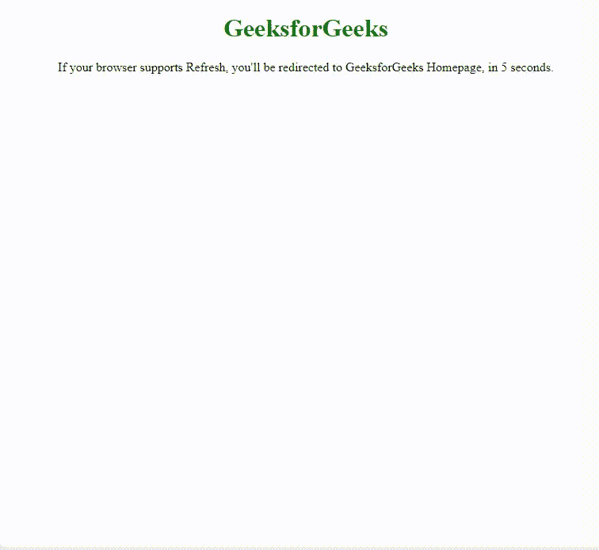

# 如何在 HTML 中将一个页面重定向到另一个页面？

> 原文:[https://www . geeksforgeeks . org/如何在 html 中将一页重定向到另一页/](https://www.geeksforgeeks.org/how-to-redirect-a-page-to-another-page-in-html/)

**问题陈述:**本文的目的是使用 HTML 将一个页面重定向到另一个页面。

**方法:**要从一个 HTML 页面重定向到另一个页面，可以使用 **< meta >** 标签。这是客户端重定向，浏览器请求服务器提供另一个页面。另外，使用 http-equiv 属性为内容属性值提供一个 http 头。content 属性中的值是您希望页面在之后重定向的秒数。为了立即加载，您可以将其设置为 0。某些浏览器无法正确呈现刷新标签。在下一页加载之前，用户可能会看到一条消息。当您添加这样的快速链接时，一些旧浏览器无法正确刷新。在这种情况下，您应该添加一个锚定链接，让用户跟随到下一页。

**语法:**

```html
<meta http-equiv = "refresh" content = " time ; url = link"/>
```

下面的例子说明了这种方法。

**示例:**

## 超文本标记语言

```html
<!DOCTYPE html>
<html>

<head>
  <title>HTML Redirect</title>
  <meta http-equiv="refresh" 
        content="5; url = https://ide.geeksforgeeks.org" />
</head>

<body>
  <h1 style="text-align:center;color:green;">
    GeeksforGeeks
  </h1>

  <p style="text-align:center;">
    If your browser supports Refresh,
    you'll be redirected to GeeksforGeeks
    Homepage, in 5 seconds.
  </p>

</body>

</html>
```

**输出:**



**支持的浏览器:**

*   谷歌 Chrome
*   微软公司出品的 web 浏览器
*   火狐浏览器
*   旅行队
*   歌剧
*   边缘

HTML 是网页的基础，通过构建网站和网络应用程序用于网页开发。您可以通过以下 [HTML 教程](https://www.geeksforgeeks.org/html-tutorials/)和 [HTML 示例](https://www.geeksforgeeks.org/html-examples/)从头开始学习 HTML。