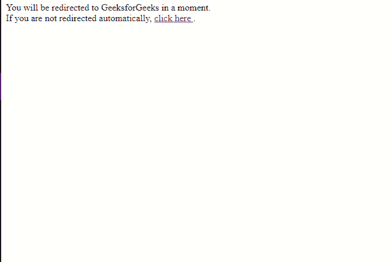
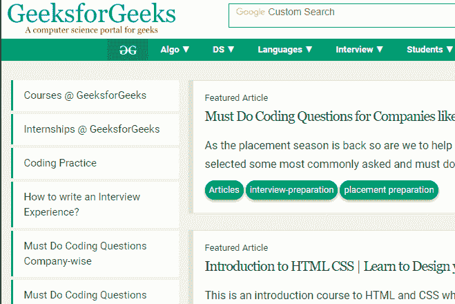

# 如何在 HTML 中重定向到另一个网页？

> 原文:[https://www . geesforgeks . org/如何重定向到另一个网页-在 html 中/](https://www.geeksforgeeks.org/how-to-redirect-to-another-webpage-in-html/)

通常需要在加载网页时重定向到另一个网页，例如，由于内容被移动到新网页。

这里演示了两种简单的方法，可以在加载时重定向到另一个网页。

**方法-1:** 使用 HTML 中元标签的 **http-equiv 属性**。

**语法:**

```html
<meta http-equiv="refresh" content="seconds; url=URL">

```

**示例-1:**

```html
<!DOCTYPE HTML>
<html>

<head>
    <title>
        Redirect to GeeksforGeeks
    </title>
    <!-- meta tag to redirect to 
     ide.geeksforgeeks.org after 2 seconds -->
    <meta http-equiv="refresh"
          content="2; 
                url=https://ide.geeksforgeeks.org/">
</head>

<body>
    <!-- Link to the destination page 
      in case the refresh does not work -->
    You will be redirected to GeeksforGeeks in a moment.
    <br> 
    If you are not redirected automatically, 
    <a href="https://ide.geeksforgeeks.org/">
      click here
    </a>.
</body>

</html>
```

**输出:**
**前:**


**2 秒后:**


**注意:**在某些较旧的浏览器中，如 Internet Explorer 6，刷新可能会导致意外结果，并削弱浏览器的“后退”按钮。这在大多数现代浏览器(Internet Explorer 7 及更高版本、谷歌 Chrome、Mozilla Firefox、微软 Edge)中得到了补偿。

**方法-2:** 使用 JavaScript 中的 **location.href** 。

**语法:**

```html
window.location.href = "URL"

```

**示例-2:**

```html
<!DOCTYPE HTML>
<html>

<head>
    <title>
        Redirect to GeeksforGeeks
    </title>
    <script type="text/javascript">

        /* location.href used to
        redirect to ide.geeksforgeeks.org */
        window.location.href =
          "https://ide.geeksforgeeks.org/"
    </script>
</head>

<body>
    <!-- Link to the destination page in
     case the redirect does not work -->
    You will be redirected to GeeksforGeeks in a moment.
    <br>
    If you are not redirected automatically, 
  <a href="https://ide.geeksforgeeks.org/">
    click here 
   </a>.
</body>

</html>
```

**输出:**


**注意:**这个方法对于任何支持 JavaScript 的浏览器都可以很好地工作。