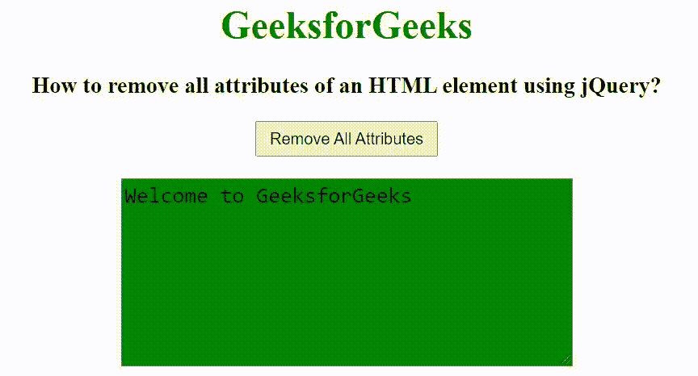

# 如何使用 jQuery 移除一个 HTML 元素的所有属性？

> 原文:[https://www . geeksforgeeks . org/如何使用-jquery/](https://www.geeksforgeeks.org/how-to-remove-all-attributes-of-an-html-element-using-jquery/) 移除 html 元素的所有属性

在本文中，我们将看到如何使用 jQuery 移除 HTML 元素的所有属性。要移除元素的所有属性，我们使用 **removeAttributeNode()方法**。

**语法:**

```html
$.fn.removeAllAttributes = function() {
    return this.each(function() {
        $.each(this.attributes, function() {
            this.ownerElement.removeAttributeNode(this);
        });
    });
};

$('textarea').removeAllAttributes();
```

在下面的例子中，我们创建了一个 textarea 元素，它包含一些属性，如行、列、id 和名称。当我们在 textarea 元素上应用上述代码时，所有属性都将被移除。

**示例:**

## 超文本标记语言

```html
<!DOCTYPE html>
<html>

<head>
    <title>
        How to remove all attributes of 
        an HTML element using jQuery?
    </title>

    <script src=
"https://ajax.googleapis.com/ajax/libs/jquery/3.3.1/jquery.min.js">
    </script>

    <style>
        #txtarea {
            font-size: 18px;
            background-color: green;
        }
    </style>

    <script>
        $(document).ready(function() {
            $("#position").on('click', function() {
                $.fn.removeAllAttributes = function() {
                    return this.each(function() {
                        $.each(this.attributes, function() {
                            this.ownerElement.removeAttributeNode(this);
                        });
                    });
                };
                $('textarea').removeAllAttributes();
            });
        });
    </script>
</head>

<body>
    <center>
        <h1 style="color: green;">
            GeeksforGeeks
        </h1>

        <h3>
            How to remove all attributes of 
            an HTML element using jQuery?
        </h3>

        <input type="button" id="position" 
            value="Remove All Attributes" 
            style="padding: 5px 10px;">
        <br><br>

        <textarea rows="7" cols="35" id="txtarea" 
            name="comment">Welcome to GeeksforGeeks
        </textarea>
    </center>
</body>

</html>
```

**输出:**

