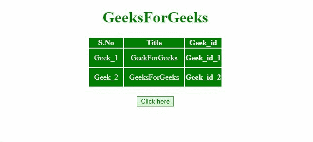

# 如何用 JavaScript 从 HTML 表格中删除列？

> 原文:[https://www . geesforgeks . org/如何使用 javascript 从 html 表中删除列/](https://www.geeksforgeeks.org/how-to-remove-column-from-html-table-using-javascript/)

给定一个 HTML 表，任务是从 HTML 表中删除特定的列。下面讨论两种方法:

**方法 1:** 首先，选择表格，并使用**表格行**获取表格行。获取一行的列数，并遍历每一列。使用 **str.search(“某些列名”)**(因为，我们想要删除带有某些列名的列)来匹配当前列名和我们想要删除的列名。如果列名匹配，则通过**删除其每个单元格。deleteCell(i)方法**(其中，I 是列索引)通过遍历表格的每一行。

**示例:**该示例实现了上述方法。

```html
<!DOCTYPE HTML>
<html>

<head>
    <title>
        How to Remove Column from
        HTML Table using JavaScript ?
    </title>

    <style>
        #myCol {
            background: green;
        }

        table {
            color: white;
            margin: 0 auto;
        }

        td {
            padding: 10px;
        }
    </style>
</head>

<body style="text-align:center;">

    <h1 style="color:green;">
        GeeksForGeeks
    </h1>

    <table id="table">
        <colgroup>
            <col id="myCol" span="2">
            <col style="background-color:green">
        </colgroup>

        <tr>
            <th>S.No</th>
            <th>Title</th>
            <th>Geek_id</th>
        </tr>
        <tr>
            <td>Geek_1</td>
            <td>GeekForGeeks</td>
            <th>Geek_id_1</th>
        </tr>
        <tr>
            <td>Geek_2</td>
            <td>GeeksForGeeks</td>
            <th>Geek_id_2</th>
        </tr>
    </table>
    <br>

    <button onclick="Geeks()">
        Click here
    </button>

    <p id="GFG_DOWN" style="color:green; 
        font-size: 20px; font-weight: bold;">
    </p>

    <script>
        function Geeks() {
            var el_down = document.getElementById("GFG_DOWN");
            var tble = document.getElementById('table');
            var row = tble.rows; // Getting the rows

            for (var i = 0; i < row[0].cells.length; i++) {

                // Getting the text of columnName
                var str = row[0].cells[i].innerHTML;

                // If 'Geek_id' matches with the columnName 
                if (str.search("Geek_id") != -1) { 
                    for (var j = 0; j < row.length; j++) {

                        // Deleting the ith cell of each row
                        row[j].deleteCell(i);
                    }
                }
            }
            el_down.innerHTML = 
                "Column is removed from the table.";
        }
    </script>
</body>

</html>
```

**输出:**


**方法 2:** 选择表格，使用**表格获取表格的行，行**遍历整个表格。获取变量(我们要移除的列)中的列索引。通过**删除每个单元格。deleteCell(i)方法**(其中，I 是列索引)通过遍历表格的每一行。

**示例:**该示例实现了上述方法。

```html
<!DOCTYPE HTML>
<html>

<head>
    <title>
        How to Remove Column from HTML
        Table using JavaScript ?
    </title>

    <style>
        #myCol {
            background: green;
        }

        table {
            color: white;
            margin: 0 auto;
        }

        td {
            padding: 10px;
        }
    </style>
</head>

<body style="text-align:center;">

    <h1 style="color:green;">
        GeeksForGeeks
    </h1>

    <table id="table">
        <colgroup>
            <col id="myCol" span="2">
            <col style="background-color:green">
        </colgroup>
        <tr>
            <th>S.No</th>
            <th>Title</th>
            <th>Geek_id</th>
        </tr>
        <tr>
            <td>Geek_1</td>
            <td>GeekForGeeks</td>
            <th>Geek_id_1</th>
        </tr>
        <tr>
            <td>Geek_2</td>
            <td>GeeksForGeeks</td>
            <th>Geek_id_2</th>
        </tr>
    </table>
    <br>
    <button onclick="Geeks()">
        Click here
    </button>
    <p id="GFG_DOWN" style="color:green; 
        font-size: 20px; font-weight: bold;">
    </p>

    <script>
        function Geeks() {
            var el_down = document.getElementById("GFG_DOWN");

            // Getting the table
            var tble = document.getElementById('table'); 

            // Getting the rows in table.
            var row = tble.rows;  

            // Removing the column at index(1).  
            var i = 1; 
            for (var j = 0; j < row.length; j++) {

                // Deleting the ith cell of each row.
                row[j].deleteCell(i);
            }
            el_down.innerHTML = 
                "Column is removed from the table.";
        }
    </script>
</body>

</html>
```

**输出:**
