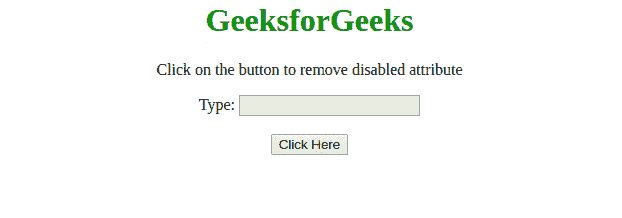

# 如何使用 JavaScript 从 HTML 输入元素中移除“禁用”属性？

> 原文:[https://www . geesforgeks . org/如何使用 javascript 从 html 输入元素中移除禁用属性/](https://www.geeksforgeeks.org/how-to-remove-disabled-attribute-from-html-input-element-using-javascript/)

任务是使用 JavaScript 从输入元素中移除禁用的属性。下面讨论两种方法。

**方法 1:** 选择输入元素并使用 [**禁用属性**](https://www.geeksforgeeks.org/html-disabled-attribute/) 并将其值设置为假。

*   **例:**

    ```html
    <!DOCTYPE html>
    <html>

    <head>
        <title>
            How to remove “disabled” attribute from
            HTML input element using JavaScript ?
        </title>
        <style>
            body {
                text-align: center;
            }

            h1 {
                color: green;
            }
        </style>
    </head>

    <body>
        <h1 style="color:green;"> 
                GeeksforGeeks 
        </h1>
        <p>
            Click on the button to remove disabled attribute
        </p>
        Type:
        <input id="input" disabled />
        <br>
        <br>
        <button onclick="myGFG()">
            Click Here
        </button>
        <p id="gfg">
        </p>
        <script>
            var down = document.getElementById("gfg");

            function myGFG() {
                document.getElementById('input').disabled = false;
                down.innerHTML = "Disabled Attribute removed";
            }
        </script>
    </body>

    </html>
    ```

*   **输出:** 

**方法 2:** 选择输入元素并使用 [**禁用属性**](https://www.geeksforgeeks.org/html-onchange-event-attribute/) 并将其值设置为假。本示例根据输入元素的类别选择输入元素。

*   **例:**

    ```html
    <!DOCTYPE HTML>
    <html>

    <head>
        <title>
            How to remove “disabled” attribute from
            HTML input element using JavaScript ?
        </title>
        <style>
            body {
                text-align: center;
            }

            h1 {
                color: green;
            }
        </style>
    </head>

    <body>
        <h1 style="color:green;"> 
                GeeksforGeeks 
        </h1>
        <p>
            Click on the button to remove disabled attribute
        </p>
        Type:
        <input id="input" disabled />
        <br>
        <br>
        <button onclick="myGFG()">
            Click Here
        </button>
        <p id="gfg">
        </p>
        <script>
            var down = document.getElementById("gfg");

            function myGFG() {
                var input = document.getElementsByClassName('inputClass');
                for (var i = 0; i < input.length; i++) {
                    input[i].disabled = false;
                }
                down.innerHTML = "Disabled Attribute removed";
            }
        </script>
    </body>

    </html>
    ```

*   **输出:** 