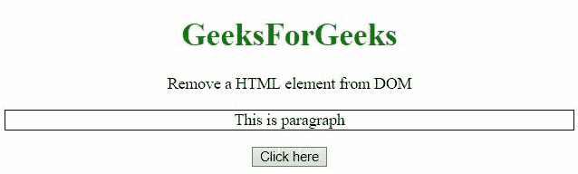
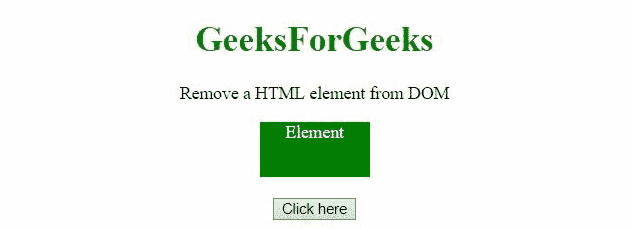

# 如何使用 AngularJS 从 DOM 中移除 HTML 元素？

> 原文:[https://www . geeksforgeeks . org/how-to-remove-html-element-from-DOM-using-angularjs/](https://www.geeksforgeeks.org/how-to-remove-html-element-from-dom-using-angularjs/)

这里的任务是在 AngularJS 的帮助下从 DOM 中移除一个特定的元素。

**方法:**这里我们首先选择要移除的元素。然后我们使用**移除()方法**移除该特定元素。

**示例 1:** 这里类(' p ')的元素已经被移除。

```html
<!DOCTYPE HTML>
<html>

<head>
    <script src=
"//ajax.googleapis.com/ajax/libs/angularjs/1.2.13/angular.min.js">
    </script>

<script>
        var myApp = angular.module("app", []);
        myApp.controller("controller", function ($scope) {
            $scope.removeEl = function () {
                var el = angular.element(
                    document.querySelector('.p'));
                el.remove();
            };
        });
    </script>
    <style>
        .p {
            border: 1px solid black;
        }
    </style>
</head>

<body style="text-align:center;">
    <h1 style="color:green;">
        GeeksForGeeks
    </h1>
    <p>
        Remove a HTML element from DOM
    </p>
    <div ng-app="app">
        <div ng-controller="controller">
            <p class="p">This is paragraph</p>
            <input type="button" 
                value="Click here" 
                ng-click="removeEl()">
        </div>
    </div>
</body>

</html>        
```

**输出:**



**例 2:** 这里 Id('p ')的元素已经被 **remove()方法移除了。**

```html
<!DOCTYPE HTML>
<html>

<head>
    <script src=
"//ajax.googleapis.com/ajax/libs/angularjs/1.2.13/angular.min.js">
    </script>

<script>
        var myApp = angular.module("app", []);
        myApp.controller("controller", function ($scope) {
            $scope.removeEl = function () {
                var el = angular.element(
                    document.querySelector('#div'));
                el.remove();
            };
        });
    </script>
    <style>
        #div {
            height: 50px;
            width: 100px;
            margin: 0 auto;
            background: green;
            color: white;
        }
    </style>
</head>

<body style="text-align:center;">
    <h1 style="color:green;">
        GeeksForGeeks
    </h1>
    <p>
        Remove a HTML element from DOM
    </p>
    <div ng-app="app">
        <div ng-controller="controller">
            <div id="div">Element</div>
            <br>
            <input type="button" 
                value="Click here" 
                ng-click="removeEl()">
        </div>
    </div>
</body>

</html>       
```

**输出:**

