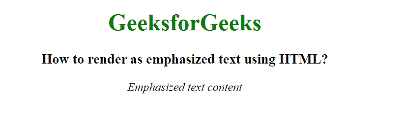

# 如何使用 HTML 渲染为强调文本？

> 原文:[https://www . geeksforgeeks . org/如何使用 html 渲染强调文本/](https://www.geeksforgeeks.org/how-to-render-as-emphasized-text-using-html/)

HTML 中的 **< em >标签**是一个短语标签，用于强调文本内容。它类似于<斜体>标签。这两个标签之间的主要区别是< em >标签在语义上强调重要的单词或单词的一部分，而< i >标签只是偏移文本，通常以斜体显示替代的语气或声音。

**注意:**使用 CSS 属性可以达到这个效果。

**语法:**

```html
<em> Contents... </em>
```

**示例 1:** 本示例使用< em >标签创建强调文本。

## 超文本标记语言

```html
<!DOCTYPE html>
<html>

<head>
    <title>
        How to render as emphasized
        text using HTML?
    </title>
</head>

<body style="text-align: center;">
    <h1 style="color:green;">
        GeeksforGeeks
    </h1>

    <h3>
        How to render as emphasized
        text using HTML?
    </h3>

    <em>Emphasized text content</em>
</body>

</html>
```

**输出:**



**示例 2:** 本示例使用带有标题属性的< em >标签来创建强调文本。

## 超文本标记语言

```html
<!DOCTYPE html>
<html>

<head>
    <title>
        How to render as emphasized
        text using HTML?
    </title>
</head>

<body style="text-align: center;">
    <h1 style="color:green;">
        GeeksforGeeks
    </h1>

    <h3>
        How to render as emphasized
        text using HTML?
    </h3>

    <em title="Emphasized text">
        Emphasized text content
    </em>
</body>

</html>
```

**输出:**


**支持的浏览器:**

*   谷歌 Chrome
*   微软公司出品的 web 浏览器
*   火狐浏览器
*   旅行队
*   歌剧