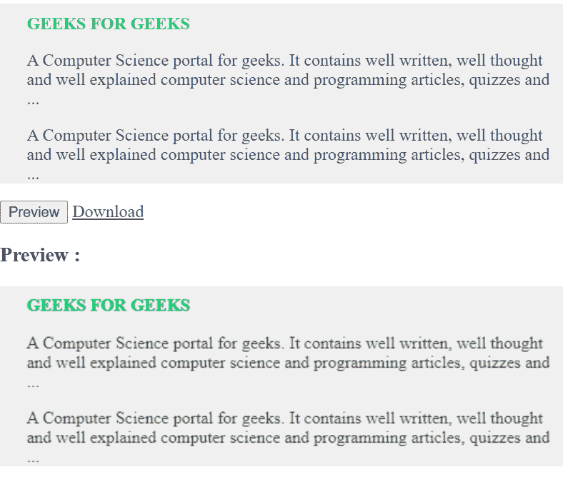

# 如何将 HTML 渲染成图像？

> 原文:[https://www . geesforgeks . org/如何将 html 渲染成图像/](https://www.geeksforgeeks.org/how-to-render-html-to-an-image/)

**HTML** 代码可以通过 html2canvas JavaScript 库等不同方式转换成图像，有时也可以通过 CSS 转换成图像，这对希望共享代码图像但无法共享确切代码的用户来说非常有帮助和有用。用户将从网页生成图像，并可以选择将网页的特定部分转换为图片。

**示例 1:** 这是一个相对简单的实现，它使用 CSS 将代码转换成图像。下面的代码不以任何方式涉及任何 JavaScript。

```html
<!DOCTYPE html>
<html>

<head>
    <title>HTML Code to Image</title>

    <style>
        .image {
            text-align: center;
            padding: 20px;
            color: white;
            font-size: 90px;
            width: 800px;
            height: 400px;
            font-family: 'Times New Roman';
            background-image: linear-gradient(
                140deg, #3a9c50 0%, #006b18 100%);
        }
    </style>
</head>

<body>
    <div class="image">
        <h4>GEEKS FOR GEEKS</h4>
    </div>
</body>

</html>
```

**输出:**


**示例 2:** 该示例实现为将 HTML 代码转换为图像，其中预览按钮显示转换后的照片。通过使用 **html2canvas** JavaScript 库，提供下载选项将其保存在本地计算机上。

```html
<!DOCTYPE html>
<html>

<head>
    <script src=
"https://ajax.googleapis.com/ajax/libs/jquery/1.11.2/jquery.min.js">
    </script>

    <script src=
"https://files.codepedia.info/files/uploads/iScripts/html2canvas.js">
    </script>

    <title>
        How to render HTML to an image?
    </title>
</head>

<body>
    <div id="html-content-holder"
        style="background-color: #F0F0F1;color: 
                #00cc65; width: 500px;
                padding-left: 25px;
                padding-top: 10px;">

        <strong>GEEKS FOR GEEKS</strong>

        <p style="color: #3e4b51;">
            A Computer Science portal for geeks. 
            It contains well written, well thought
            and well explained computer science 
            and programming articles, quizzes and ...
        </p>

        <p style="color: #3e4b51;">
            A Computer Science portal for geeks. 
            It contains well written, well thought 
            and well explained computer science and
            programming articles, quizzes and ...
        </p>
    </div>

    <input id="btn-Preview-Image" 
        type="button" value="Preview" />

    <a id="btn-Convert-Html2Image" href="#">
        Download
    </a>

    <br />

    <h3>Preview :</h3>
    <div id="previewImage"></div>

    <script>
        $(document).ready(function () {

            // Global variable
            var element = $("#html-content-holder");
            var getCanvas; // Global variable

            $("#btn-Preview-Image").on('click', function () {
                html2canvas(element, {
                    onrendered: function (canvas) {
                        $("#previewImage").append(canvas);
                        getCanvas = canvas;
                    }
                });
            });

            $("#btn-Convert-Html2Image").
                        on('click', function () {
                var imgageData = getCanvas.toDataURL("image/png");

                // Now browser starts downloading it 
                // instead of just showing it
                var newData = imgageData.replace(
                    /^data:image\/png/, 
                    "data:application/octet-stream");

                $("#btn-Convert-Html2Image")
                    .attr("download", "gfg.png")
                    .attr("href", newData);
            });
        });
    </script>
</body>

</html>
```

**输出:**
