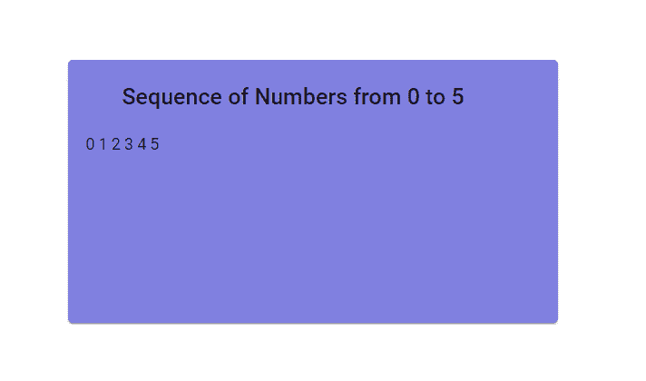
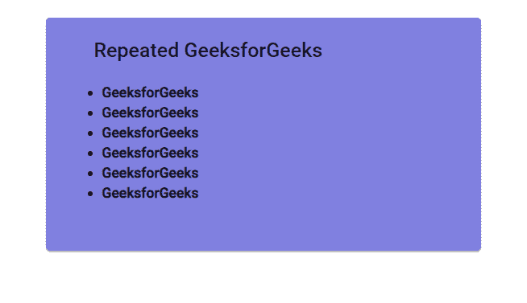

# 如何基于一个数字使用 ngFor 多次重复 HTML 元素？

> 原文:[https://www . geesforgeks . org/how-to-repeat-html-element-多次使用-ngforer-based-on-number/](https://www.geeksforgeeks.org/how-to-repeat-html-element-multiple-times-using-ngfor-based-on-a-number/)

在 Angular **中，For** 是完成用最少代码行显示重复内容或内容列表的目的的指令，这与传统编程语言中循环的**的目的相同。**

我们可以使用 javascript/typescript 函数 **Array()** 基于一个数字打印重复的内容行，该函数将生成一个从 0 到 n-1 的数字列表。我们遍历这个列表以产生 n 个重复的内容行。

**示例 1:**
**演示。组件**

```html
import { Component, OnInit } from '@angular/core';

@Component({
  selector: 'app-demo',
  templateUrl: './demo.component.html',
  styleUrls: ['./demo.component.css']
})

export class DemoComponent implements OnInit {

  constructor() {
  }
  ngOnInit() {
  }
  //function to return list of numbers from 0 to n-1
  numSequence(n: number): Array<number> {
    return Array(n);
  }
}
```

**Demo.Component.html**

```html
<mat-card class="example-card" >
  <mat-card-header>
   <h2 >Sequence of Numbers from 0 to 5</h2  >
  </mat-card-header>
  <mat-card-content>
     <!-- n traverses through a list of [0, 1, 2, 3, 4, 5] i.e 0 to 5
           i stores the index in each iteration -->
    <span *ngFor="let n of numSequence(6);
           let i = index;">{{i}} </span>
  </mat-card-content>
</mat-card>
```

**输出:**


**例 2:**
在 typescript 文件中插入模板，重复相同元素 6 次。
T4

```html
import { Component, OnInit } from '@angular/core';

@Component({
  selector: 'app-demo',
  //template encapsulated within the component ts file
  // instead of separate template(html)
  template: '
  <mat-card class="example-card" >
  <mat-card-header class="example-header">
   <h2 >Repeated GeeksforGeeks</h2  >
  </mat-card-header>
  <mat-card-content>
    <ul>
      <!--n traverses through a list of [0, 1, 2, 3, 4, 5] i.e 0 to 5
             prints GeeksforGeeks for 6 times --> 
     <li example-card-text 
         *ngFor="let n of numSequence(6)">
                <b>GeeksforGeeks</b></li>
    </ul>
  </mat-card-content>
</mat-card>
',
  styleUrls: ['./demo.component.css']
})

export class DemoComponent implements OnInit {
  constructor() {
  }

  ngOnInit() {
  }

  //function to return list of numbers from 0 to n-1
  numSequence(n: number): Array<number> {
    return Array(n);
  }
}
```

**输出:**
