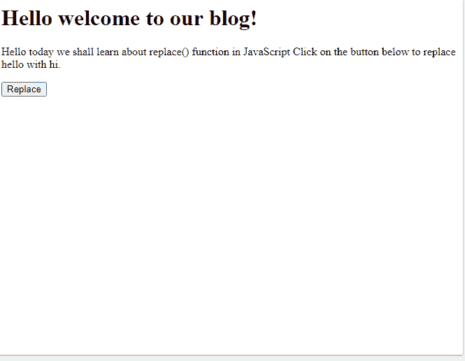
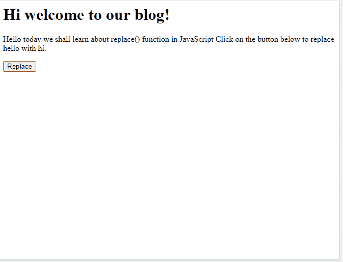
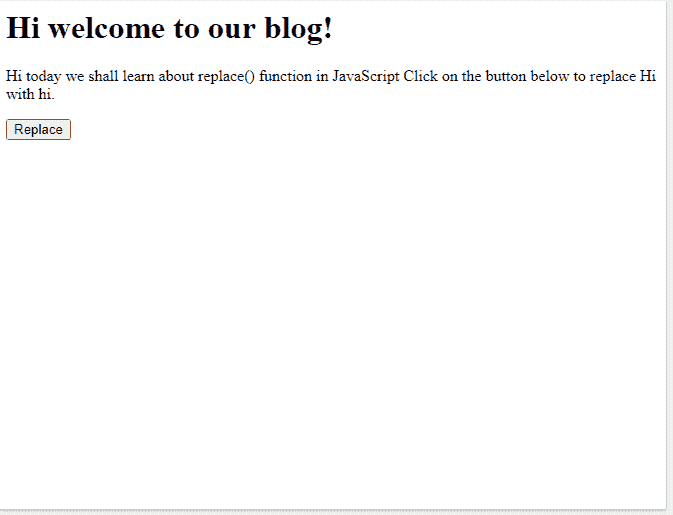
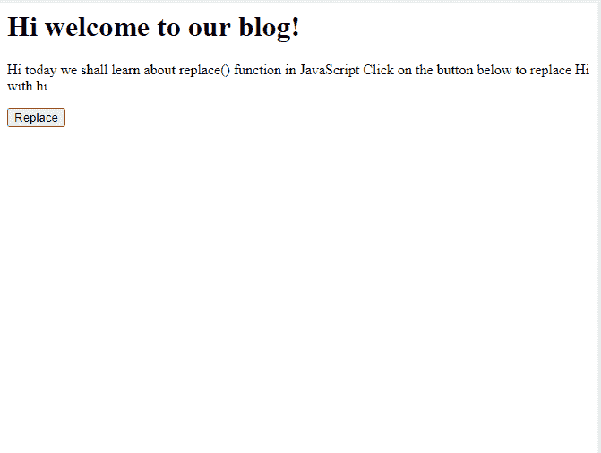
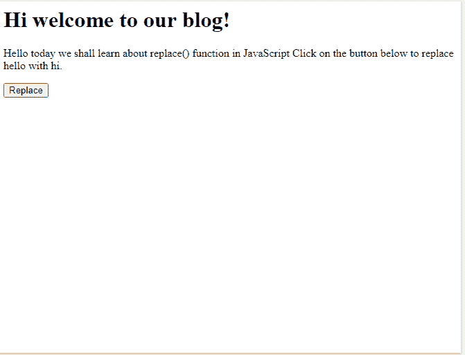

# 如何用 HTML 中的另一个单词替换所有单词？

> 原文:[https://www . geesforgeks . org/如何用 html 中的另一个单词替换所有单词/](https://www.geeksforgeeks.org/how-to-replace-all-words-with-another-words-in-html/)

JavaScript **replace()** 方法用于替换字符串或整个字符串中出现的任何字符。它搜索对应于特定值或正则表达式的字符串，并返回一个包含修改后的值的新字符串。

也可以使用**正则表达式**代替字符串来定义要替换的字符或字符串。正则表达式是包含特殊符号和字符的字符串，用于从给定数据中查找和提取所需信息。正则表达式基本上是包含有助于选择所需值的字符和特殊符号的字符串。

需要注意的是， **replace()** 函数将只替换指定值的第一次出现。为了替换所有事件，必须使用**全局修改器**。

**语法:**

```
string.replace(valueToBeReplaced, newValue)
```

其中“valueToBeReplaced”可以是字符串值，也可以是正则表达式。

**示例 1:** 将使用 replace()函数将字符串“Hello”替换为“Hi”

## 超文本标记语言

```
<!DOCTYPE html>
<html>

<head>
    <title>Replace Example</title>
</head>

<body>
    <h1>Hello welcome to our blog!</h1>

    <p>
        Hello today we shall learn about
        replace() function in JavaScript
        Click on the button below to replace
        hello with hi.
    </p>

    <button onclick="rep()">Replace</button>

    <script>

        // Replace the first "Hello"
        // in the page with "Hi"
        function rep() {
            document.body.innerHTML
                = document.body.innerHTML
                .replace("Hello", "Hi");
        }
    </script>
</body>

</html>
```

**输出:**

*   **点击按钮前:**

    

*   **点击按钮后:**

    

如上面的输出所示，只有第一次出现的“Hello”被替换为“Hi”。要替换所有事件，必须使用全局修改器。

**示例 2:** 使用 replace()函数将所有出现的字符串“Hello”替换为“Hi”

## 超文本标记语言

```
<!DOCTYPE html>
<html>

<head>
    <title>Replace Example</title>
</head>

<body>
    <h1>Hello welcome to our blog!</h1>

    <p>Hello today we shall learn about
        replace() function in JavaScript
        Click on the button below to
        replace hello with hi.
    </p>

    <button onclick="rep()">Replace</button>
    <script>

        // Replace all the "Hello" 
        // in the page with "Hi"
        function rep() {
            document.body.innerHTML =
                document.body.innerHTML
                .replace(/Hello/g, "Hi");
        }
    </script>
</body>

</html>
```

**输出:**

*   **点击按钮前:**

    

*   **点击按钮后:**

    

在下一个示例中，全局修饰符和“I”修饰符都用于确保给定单词的所有出现都被替换，而不管它们的大小写。

**示例 3:** 使用 replace()函数将所有出现的字符串“Hello”替换为“Hi”，而不管它们的大小写。

## 超文本标记语言

```
<!DOCTYPE html>
<html>

<head>
    <title>Replace Example</title>
</head>

<body>
    <h1>Hello welcome to our blog!</h1>

    <p>
        Hello today we shall learn about
        replace() function in JavaScript
        Click on the button below to
        replace hello with hi.

    </p>

    <button onclick="rep()">
        Replace
    </button>

    <script>
        // Replace all the "Hello" in the
        // page with "Hi" irrespective of
        // the case
        function rep() {
            document.body.innerHTML =
                document.body.innerHTML
                .replace(/Hello/gi, "Hi");
        }
    </script>
</body>

</html>
```

**输出:**

*   **点击按钮前:**

    

*   **点击按钮后:**

    

**示例 4:** 使用 replace()函数将字符串“Hello”在特定标签上的所有出现替换为“Hi”。

## 超文本标记语言

```
<!DOCTYPE html>
<html>

<head>
    <title>Replace Example</title>
</head>

<body>
    <h1>Hello welcome to our blog!</h1>

    <p>Hello today we shall learn about
        replace() function in JavaScript
        Click on the button below to replace
        hello with hi.

    </p>

    <button onclick="rep()">Replace</button>

    <script>
        // Replace all the "Hello" in the
        // page with "Hi" irrespective of the case
        // with the h1 tag
        function rep() {
            document.getElementById('h1').innerHTML
                = document.getElementById('h1')
                    .innerHTML.replace(/Hello/g, "Hi");
        }
    </script>
</body>

</html>
```

**输出:**

*   **点击按钮前:**

    

*   **点击按钮后:**

    

如输出中所示，只有代码 h1 标记部分中出现的“Hello”被替换为“Hi”。