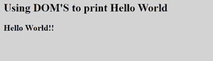

# 如何用 JavaScript 将一个 HTML 元素替换成另一个？

> 原文:[https://www . geesforgeks . org/如何使用 javascript 将一个 html 元素替换为另一个元素/](https://www.geeksforgeeks.org/how-to-replace-an-html-element-with-another-one-using-javascript/)

文档对象模型(DOM)是一个平台和语言中立的接口，程序和脚本使用它来动态地访问内容、风格和结构。详见 [DOM(文档对象模型)](https://www.geeksforgeeks.org/dom-document-object-model/)。我们可以通过使用 DOM 的 **createElement()** 、 **createTextNode()** 、 **appendChild()** 、 **replaceChild()** 方法和 *childNodes* 属性来实现。

让我们讨论这些方法和属性来将一个 HTML 元素替换为另一个。

*   **createElement():** It is used to create an element node with the specified name.
    **Syntax:**

    ```html
    var element = document.createElement("Element_name"); 

    ```

    在这个例子中，元素是“h1”标签，所以写

    ```html
     var element=document.createElement("h1");
    ```

*   **createTextNode():** 该方法用于创建文本节点。
    **语法:**

    ```html
     var txt = document.createTextNode("Some_Text");
    ```

*   **appendChild():** After creating text node, we have to append it to the element by using **appendChild()** method.

    **语法:**

    ```html
     element.appendChild(Node_To_append);
    ```

下面显示了如何使用上面讨论的这些方法和属性的工作代码。

## 超文本标记语言

```html
<!DOCTYPE html>
<html>

<body>
    <h2>
        Using DOM'S to print Hello World 
    </h2>

    <script>
        var h = document.createElement("h3");

        var txt = document
            .createTextNode("Hello World!!");

        h.appendChild(txt);

        document.body.appendChild(h);
    </script>
</body>

</html>
```

**输出:**

*   **点击按钮前:**
    
*   **点击按钮后:**
    

**子节点[位置]:** 该属性返回一个作为节点列表对象的子节点集合。这些节点按照它们在源代码中出现的方式进行排序，并且可以通过从 0 开始的索引号进行访问。

**replaceChild():** 它用新节点替换一个子节点。

```html
old_Node.replaceChild(new_Node, old_node.childNodes[node_position]);
```

**示例:**下面的代码展示了如何用另一个元素替换另一个元素。

## 超文本标记语言

```html
<!DOCTYPE html>
<html>

<body>
    <div id="p1">
        <p id="red">Hello World </p>

        <!-- We are going to replace Hello World!! 
            in "p" tag with "Hello Geeks" in "h2" 
            tag-->
        <button onclick="repFun()">
            Click Me
        </button>
    </div>

    <p id="demo"></p>

    <script>
        function repFun() {

            // Creating "h2" element
            var H = document.createElement("h2");

            // Retaining id  
            H.setAttribute("id", "red");

            // Creating Text node        
            var txt = document.createTextNode("Hello Geeks!!");

            // Accessing  the Element we want to replace 
            var repNode = document.getElementById("p1");

            // Appending Text Node in Element  
            H.appendChild(txt);

            // Replacing one element with another
            p1.replaceChild(H, p1.childNodes[0]);
        }
    </script>
</body>

</html>
```

**输出:**

*   **点击按钮前:**
    
*   **点击按钮后:**
    