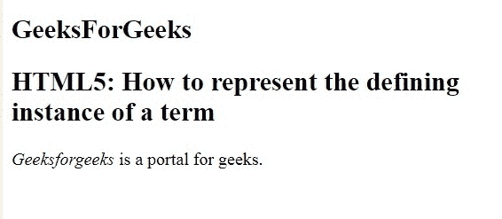
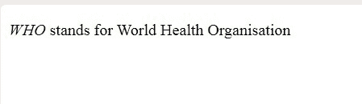

# 如何用 Html 表示一个术语的定义实例？

> 原文:[https://www . geeksforgeeks . org/如何在 html 中表示术语的定义实例/](https://www.geeksforgeeks.org/how-to-represent-the-defining-instance-of-a-term-in-html/)

在本文中，我们使用 **dfn** 元素来表示术语的定义实例，通常，定义实例是术语在文档中的第一次使用。< dfn >标签需要一个开始标签和一个结束标签。

**语法:**

```html
<dfn>.....</dfn>
```

以下示例说明了 HTML 中的 dfn 标签:
**示例-1:**

```html
<!DOCTYPE html> 
<html> 
    <head> 
        <title>Represent the defining 
               instance of a term
        </title> 
    </head> 
    <body>
        <h2>GeeksForGeeks</h2> 
        <h2>HTML5: How to represent the defining
                instance of a term
        </h2>
 <p><dfn>Geeksforgeeks</dfn> is a portal for geeks.</p> 
    </body> 
</html>
```

**输出**


**示例-2:**

```html
<!DOCTYPE html>
<html>
<head>
  <meta charset="utf-8">
  <title>Represent the defining instance of a term</title>
</head>
<body>
<p><dfn>WHO</dfn> stands for World Health Organisation</p>  
</body>
</html>
```

**输出:**


**支持的浏览器如下:**

*   谷歌 Chrome
*   微软公司出品的 web 浏览器
*   火狐浏览器
*   歌剧
*   旅行队