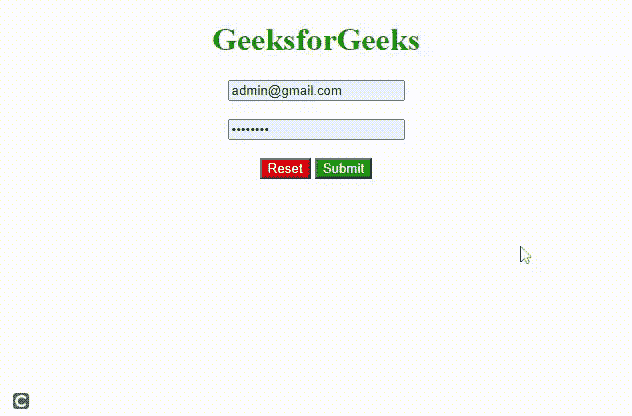

# 如何在 HTML 中使用按钮重置所有表单值？

> 原文:[https://www . geesforgeks . org/如何使用 html 中的按钮重置所有表单值/](https://www.geeksforgeeks.org/how-to-reset-all-form-values-using-a-button-in-html/)

您可以使用 HTML 按钮使用 [**<输入 type="reset"**](https://www.geeksforgeeks.org/html-input-typereset/) >属性轻松重置所有表单值。在用户开始向字段输入值、选择单选按钮、复选框等之前，单击重置按钮将表单恢复到其原始状态(默认值)。可能有很多情况。

在本文中，我们将学习如何清除输入字段。

**语法:**

```html
<input type="reset">
```

**示例:**

## 超文本标记语言

```html
<!DOCTYPE html>
<html>

<body>
    <center>
        <h1 style="color: green;">
            GeeksforGeeks
        </h1>

        <form>
            <input type="text" 
                placeholder="Email address" 
                id="email" name="email" />
            <br /><br />

            <input type="password" 
                placeholder="Password" id="pin" 
                name="password" maxlength="8" />
            <br /><br />

            <input type="reset" value="Reset" 
                style="background-color: red; 
                        color: white" />
            <input type="submit" value="Submit" 
                style="background-color: green; 
                        color: white" />
        </form>
    </center>
</body>

</html>
```

**输出:**

