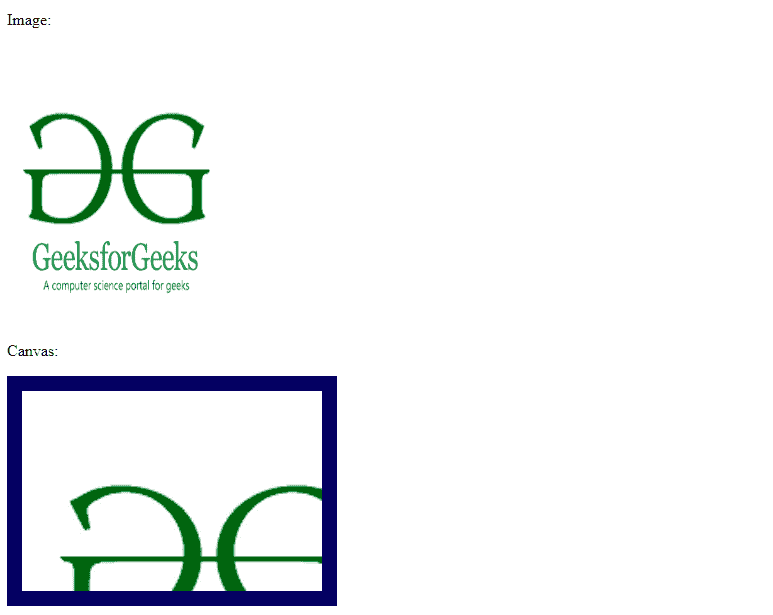

# 如何在 HTML 5 画布中调整图像大小？

> 原文:[https://www . geesforgeks . org/如何在 html-5 画布中调整图像大小/](https://www.geeksforgeeks.org/how-to-resize-an-image-in-an-html-5-canvas/)

画布元素是 HTML 5 的一部分，它允许渲染 2D 形状和位图(也称为“光栅”)图像。
画布实际上有两种尺寸:

*   元素的大小。
*   元素绘图表面的大小。

元素的宽度和高度属性设置元素的大小和元素绘图表面的大小。CSS 属性只影响元素的大小，而不影响绘图表面。

**示例:**

```html
<!DOCTYPE html>
<html>

<body>

    <p>Image:</p>

    

    <p>Canvas:</p>

    <canvas id="Canvas" width="300" height="200"
                style="border:15px solid #000066;">
        Your browser not support the HTML5 canvas .
    </canvas>

    <script>
        window.onload = function() {
            var canvas = document.getElementById("Canvas");
            var context = canvas.getContext("2d");
            var img = document.getElementById("forest");
            context.drawImage(img, 12, 8);
        };
    </script>
</body>

</html>    
```

**输出:**
