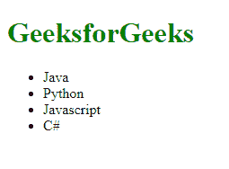

# 如何返回 HTML 或者用 JavaScript 构建 HTML？

> 原文:[https://www . geesforgeks . org/how-return-html-or-build-html-using-JavaScript/](https://www.geeksforgeeks.org/how-to-return-html-or-build-html-using-javascript/)

JavaScript 非常强大，有了它，我们可以构建动态 web 内容，并为 web 应用程序添加许多功能。使用 HTML，我们创建了网页的结构，同样的事情也可以用 JavaScript 来完成。

很少有被称为 createElement()和 appendChild()的 JavaScript 方法，我们可以用它们动态地向 DOM 树添加节点。

**示例 1:创建 div 元素**

假设您只想创建一个 div 元素，那么下面是代码片段:

```html
let div_element = document.createElement("div")
```

**示例 2:向 HTML 元素添加子节点**

假设有一个 ID 为“divele”的 div

```html
<div id="divele"></div>
```

您想在 div 中添加一个段落元素。下面是代码片段

## java 描述语言

```html
let div_elem = document.getElementById("divele")

let child_p_elem = document.createElement("p")

div_elem.appendChild(child_p_elem)
```

这段代码片段在 appendChild()方法的帮助下，在 div 中添加了一个段落元素。

**示例 3:移除 HTML 元素的子节点**

考虑一个包含 3 个列表项的无序列表。并且您想要移除其中的第一个子

*   Elements.

## 超文本标记语言

```html
<ul id="ulele">
  <li>Food</li>
  <li>Milk</li>
  <li>Vegetable</li>
</ul>
```

使用 removeChild()方法，我们可以从无序列表中移除第一个

*   Child:

## java 描述语言

```html
let ul_ele = document.getElementById("ulele")

// 0 represents the first child
ul_ele.removeChild(ul_ele.childNodes[0])
```

**示例 4:访问父 HTML 元素的所有子元素**

现在，要访问 id 为“divele”的 div 的所有子元素，我们将使用 childNodes()方法，该方法将返回所需的子节点。

## java 描述语言

```html
let div_ele = document.getElementById("divele")

// Returns an array of child nodes
// contained inside the parent node
let div_ele_childs = div_ele.childNodes 
```

请在下面找到我们将要开发的简单网页的快照。

**完整代码:**

## 超文本标记语言

```html
<!DOCTYPE html>
<html lang="en">

<body>
    <div id="divele">

    </div>
    <script type="text/javascript">
        let parentDiv = document.getElementById("divele")

        let heading = document.createElement("h1")

        let unordered_list = document.createElement("ul")

        unordered_list.setAttribute("id", "ulele")

        heading.style.color = "green"
        heading.textContent = "GeeksforGeeks"

        parentDiv.appendChild(heading)

        parentDiv.appendChild(unordered_list)

        for (let i = 0; i < 4; i++) {
            let li_elem = document.createElement("li")
            unordered_list.appendChild(li_elem)
        }

        unordered_list.childNodes[0].textContent = "Java"
        unordered_list.childNodes[1].textContent = "Python"
        unordered_list.childNodes[2].textContent = "Javascript"
        unordered_list.childNodes[3].textContent = "C#"
    </script>
</body>

</html>
```

**输出:**

