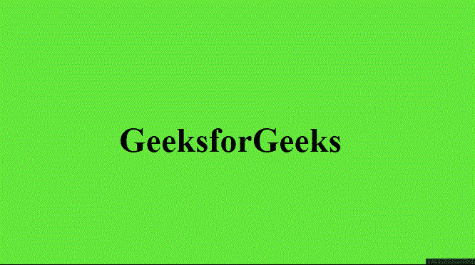

# 如何使用 HTML 和 CSS 在悬停时将文本旋转 360 度？

> 原文:[https://www . geesforgeks . org/如何使用 html 和 css 将文本旋转 360 度/悬停/](https://www.geeksforgeeks.org/how-to-rotate-a-text-360-degrees-on-hover-using-html-and-css/)

文本可以使用基本的 HTML 和 CSS 旋转 360 度，这个动画可以用作网站中的标题或副标题，使其看起来更有吸引力。以下部分将指导您如何创建所需的效果。

*   **HTML 代码**:在这一部分我们将创建一个基本的 *div* 元素，里面会有一些*文本*。

## 超文本标记语言

```html
<!DOCTYPE html>
<html lang="en" dir="ltr">

<head>
    <meta charset="utf-8">
    <title>Rotate text 360 degrees</title>

</head>

<body>
    <div>
        <h2>GeeksforGeeks</h2>
    </div>
</body>
</html>
```

*   **CSS 代码:**在本节中，我们将首先使用基本的 CSS 属性设计文本，然后使用 **@** *关键帧* 规则创建动画，我们将使用*变换*属性以规则的间隔将文本旋转 360 度。

## 钢性铸铁

```html
<style>
        body {
            margin: 0;
            padding: 0;
            font-family: serif;
            justify-content: center;
            align-items: center;
            display: flex;
            background-color: #65E73C;
        }

        div {
            content: '';
            font-size: 2em;
            position: absolute;
            top: 50%;
            left: 50%;
            transform: translate(-50%, -50%);
        }

        h2:hover{
            animation: rotate 1s linear;
        }

        // Rotate using @keyframes
        @keyframes rotate{
            0%{
                transform: rotate(0deg);
            }
            50%{
                transform: rotate(180deg);
            }
            100%{
                transform: rotate(360deg);
            }
        }
    </style>
```

**最终代码:**是以上两个代码段的组合。

## 超文本标记语言

```html
<!DOCTYPE html>
<html lang="en" dir="ltr">

<head>
    <meta charset="utf-8">
    <title>Rotate text 360 degrees</title>

</head>
<style>
    body {
        margin: 0;
        padding: 0;
        font-family: serif;
        justify-content: center;
        align-items: center;
        display: flex;
        background-color: #65E73C;
    }

    div {
        content: '';
        font-size: 2em;
        position: absolute;
        top: 50%;
        left: 50%;
        transform: translate(-50%, -50%);
    }

    h2:hover{
        animation: rotate 1s linear;
    }

    @keyframes rotate{
        0%{
            transform: rotate(0deg);
        }
        50%{
            transform: rotate(180deg);
        }
        100%{
            transform: rotate(360deg);
        }
    }
</style>

<body>
    <div>
        <h2>GeeksforGeeks</h2>
    </div>
</body>
</html>
```

**输出:**

