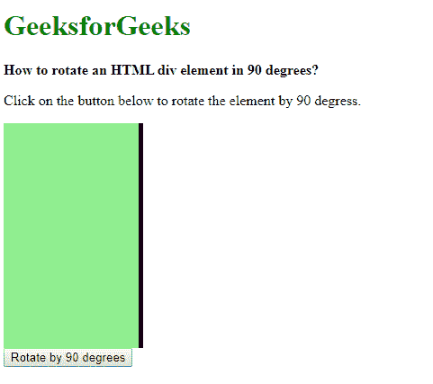
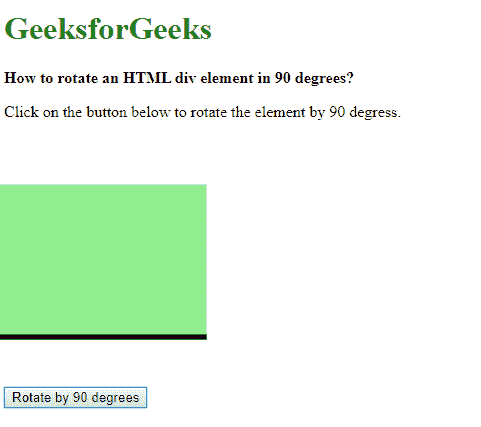

# 如何用 JavaScript 将一个 HTML div 元素旋转 90 度？

> 原文:[https://www . geesforgeks . org/如何使用 javascript 将一个 html-div-element 旋转 90 度/](https://www.geeksforgeeks.org/how-to-rotate-an-html-div-element-90-degrees-using-javascript/)

使用**变换**属性可以将元素旋转 90 度。此属性用于移动、旋转、缩放和其他对元素执行各种变换。
可以使用**旋转()**变换函数作为旋转元素的值。它采用一个定义旋转角度的参数。旋转角度由两部分组成，旋转值后跟旋转单位。单位可以用度数(度)、坡度(度)、弧度(弧度)和转角来定义。

要旋转 90 度，任何单位都可以使用其相应的值。90 度等于 100 度坡度或 0.25 圈。

将此属性应用于所需的元素会将其旋转 90 度。

**语法:**

```html
// Using CSS
transform: rotate(90deg);

// Using JavaScript
element.style.transform = 'rotate(90deg)';

```

**示例:**该示例使用矩形和边框的一侧来解释旋转。

```html
<!DOCTYPE html>
<html>

<head>
    <title>
        How to rotate an HTML div element
        90 degrees using JavaScript ?
    </title>

    <style>
        .box {
            height: 250px;
            width: 150px;
            border-right: 5px solid;
            background-color: lightgreen;
        }
    </style>
</head>

<body>
    <h1 style="color: green">
        GeeksforGeeks
    </h1>

    <b>
        How to rotate an HTML div
        element in 90 degrees?
    </b>

    <p>
        Click on the button below to rotate
        the element by 90 degress.
    </p>

    <div class="box"></div>

    <button onclick="rotateElem()">
        Rotate by 90 degrees
    </button>

    <script type="text/javascript">
        function rotateElem() {
            document.querySelector('.box').style.transform
                       = 'rotate(90deg)';
        }
    </script>
</body>

</html>
```

**输出:**

*   **点击按钮前:**
    
*   **点击按钮后:**
    