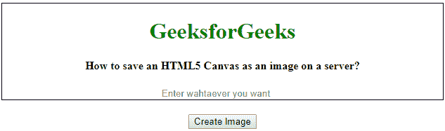
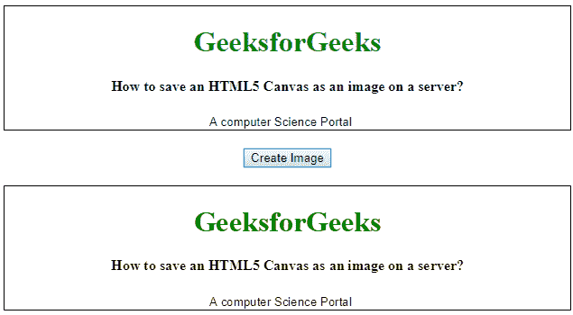

# 如何在服务器上将一个 HTML 5 Canvas 保存为图像？

> 原文:[https://www . geesforgeks . org/如何在服务器上将一个 html-5-canvas 另存为图像/](https://www.geeksforgeeks.org/how-to-save-an-html-5-canvas-as-an-image-on-the-server/)

将 HTML 画布保存为图像非常容易，只需右键单击画布并将其保存为图像即可。但是将画布保存为服务器上的图像是完全不同的。本文将向您展示如何实现这一点。有时需要在做一些服务器处理后保存画布图像，本文将帮助通过服务器发送画布图像进行处理。

在这里，您将看到如何使用 JQuery 将 HTML 内容转换成图像。我们知道有一个插件 html2canvas，通过使用该插件，我们可以轻松地将 html 内容转换为图像内容，然后我们可以通过右键单击并选择保存图像选项来保存该文件。

之后，我们将把 CANVAS 图像转换成 URL 格式，并使用 ajax 把它发送到服务器，然后主要部分将由 PHP 代码完成。PHP 代码会将该图像保存在您的服务器上。

下面的步骤将清楚地说明这种方法。

**第一步:**将画布转换为图像的 HTML 代码。

```
<!DOCTYPE html>
<html>

<head>
    <title></title>
    <link rel="stylesheet" href=
"http://maxcdn.bootstrapcdn.com/bootstrap/3.3.7/css/bootstrap.min.css">
    <script src=
"https://ajax.googleapis.com/ajax/libs/jquery/1.12.4/jquery.min.js">
    </script>
    <script src=
"http://maxcdn.bootstrapcdn.com/bootstrap/3.3.7/js/bootstrap.min.js">
    </script>
    <script src=
"https://cdnjs.cloudflare.com/ajax/libs/html2canvas/0.4.1/html2canvas.js">
    </script>
    <style>
        .top {
            margin-top: 20px;
        }

        h1 {
            color: green;
        }

        input {
            background-color: transparent;
            border: 0px solid;
            width: 300;
        }

        body {
            text-align: center;
        }
    </style>
</head>

<body>

    <div class="col-md-offset-4 col-md-4 col--md-offset-4 top">
        <div id="createImg" style="border:1px solid;">
            <h1>GeeksforGeeks</h1>
            <h4>How to save an HTML5 Canvas as an 
                           image on a server?</h4>
            <input type="text" value=""
    placeholder="Enter wahtaever you want" class="form-control" />
            <br/>
        </div>
        <button id="geeks" type="button" 
                                      class="btn btn-primary top">
            Create Image</button>
        <div id="img" style="display:none;">
            
        </div>
    </div>
    <script>
        $(function() {
            $("#geeks").click(function() {
                html2canvas($("#createImg"), {
                    onrendered: function(canvas) {
                        var imgsrc = canvas.toDataURL("image/png");
                        console.log(imgsrc);
                        $("#newimg").attr('src', imgsrc);
                        $("#img").show();
                        var dataURL = canvas.toDataURL();
                        $.ajax({
                            type: "POST",
                            url: "script.php",
                            data: {
                                imgBase64: dataURL
                            }
                        }).done(function(o) {
                            console.log('saved');
                        });
                    }
                });
            });
        });
    </script>
</body>

</html>
```

**第二步:**显示输出，检查画布是否成功转换为图像。

*   **点击按钮前:**
    
*   **点击按钮后:**
    

**第三步:**使用 canvas.toDataURL()方法将图像转换为 URL 格式。

```
var dataURL = canvas.toDataURL();
```

**步骤 4:** 通过 Ajax 将转换后的 URL 格式发送到您的服务器。

```
$.ajax({
    type: "POST",
    url: "script.php",
    data: { 
        imgBase64: dataURL
    }
}).done(function(o) {
    console.log('saved'); 
});
```

**第五步:**这段 php 代码会将图像保存到服务器中。

```
<?php  

// Requires php5  
define('UPLOAD_DIR', 'images/');  
$img = $_POST['imgBase64'];  
$img = str_replace('data:image/png;base64,', '', $img);  
$img = str_replace(' ', '+', $img);  
$data = base64_decode($img);  
$file = UPLOAD_DIR . uniqid() . '.png';  
$success = file_put_contents($file, $data);  
print $success ? $file : 'Unable to save the file.';  

?>  
```