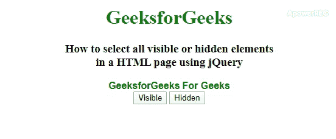

# 如何使用 jQuery 选择一个 HTML 页面中所有可见或隐藏的元素？

> 原文:[https://www . geesforgeks . org/如何使用-jquery 选择 html 页面中所有可见或隐藏的元素/](https://www.geeksforgeeks.org/how-to-select-all-visible-or-hidden-elements-in-a-html-page-using-jquery/)

为了使用 jQuery 选择页面中所有可见或隐藏的元素，我们可以使用以下 jQuery 选择器:

**[:可见选择器](https://www.geeksforgeeks.org/jquery-visible-selector/)** 可见选择器用于选择文档中当前可见的所有元素。

*   **语法:**

    ```html
    $(":visible") 
    ```

**[:隐藏选择器](https://www.geeksforgeeks.org/jquery-hidden-selector/)** 隐藏选择器选择要处理的隐藏元素。

*   **语法:**

    ```html
    $(":hidden")
    ```

以下示例说明了上述方法:
**示例:**

```html
<!DOCTYPE html>
<html>

<head>
    <title>
        How to select all visible
        or hidden elements in a
        HTML page using jQuery ?
    </title>

    <script src=
"https://code.jquery.com/jquery-1.12.4.min.js">
    </script>

    <style>
        h1 {
            color: green;
        }

        h4 {
            color: green;
        }

        body {
            text-align: center;
        }

        .geeks {
            display: inline-block;
            font: bold 16px sans-serif;
            color: green;
        }

        .hidden {
            display: none;
        }
    </style>
</head>

<body>
    <h1>GeeksforGeeks</h1>

    <h3> 
        How to select all visible or
        hidden elements<br>in a HTML
        page using jQuery
    </h3>

    <div class="geeks">GeeksforGeeks</div>

    <div class="geeks hidden">
        A Computer Sciecne Portal
    </div>

    <div class="geeks">For Geeks</div>

    <div class="geeks hidden">
        Learn Contribute Explore
    </div>
    <br>

    <button type="button" class="visibleg">
        Visible
    </button>

    <button type="button" class="hiddeng">
        Hidden
    </button>
    <br>

    <h4></h4>

    <script>
        $(document).ready(function() {
            $(".visibleg").click(function() {
                var visibleBoxes = [];
                $.each($(".geeks"), function() {
                    if ($(this).is(":visible")) {
                        visibleBoxes.push($(this).text());
                    }
                });
                $("h4").text("Visible items are - "
                            + visibleBoxes.join(", "));
            });

            // Get hidden items
            $(".hiddeng").click(function() {
                var hiddenBoxes = [];
                $.each($(".geeks"), function() {
                    if ($(this).is(":hidden")) {
                        hiddenBoxes.push($(this).text());
                    }
                });
                $("h4").text("Hidden items are - " 
                            + hiddenBoxes.join(", "));
            });
        });
    </script>
</body>

</html>
```

**输出:**
