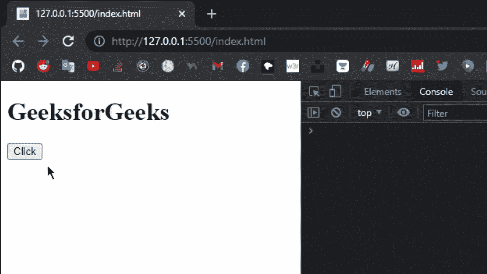
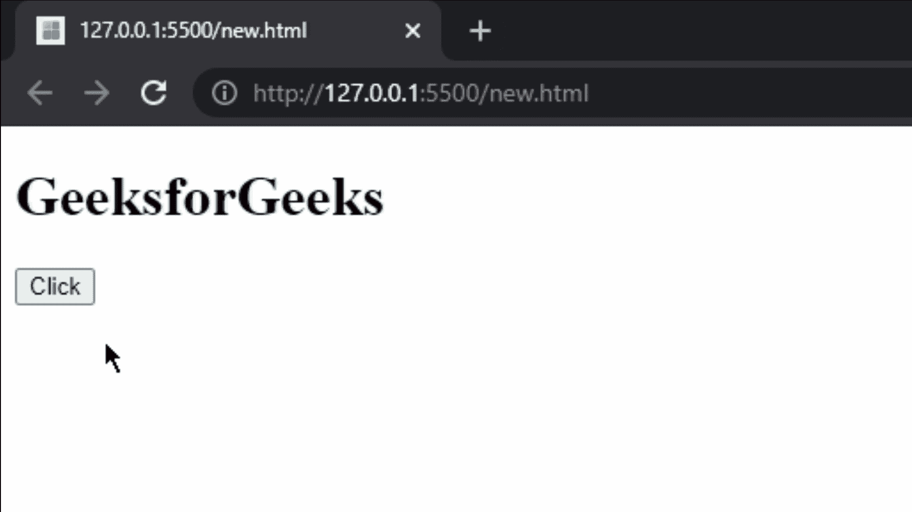

# 如何在 HTML 中选择包含 Meta Character 的 id？

> 原文:[https://www . geeksforgeeks . org/如何选择包含 html 元字符的 id/](https://www.geeksforgeeks.org/how-to-select-id-that-contains-meta-character-in-html/)

**简介:**在编程中，很多时候我们都见过 Metacharacter，在进入主题之前，我们先来简单介绍一下 Meta 字符。这些是程序中具有特殊意义的特殊字符。有几个元字符，下面列出了其中一些:

**示例:**

```
 /  $  [  ]  {  }  |  *
```

**方法:**假设我们必须改变位于 **h1** 标签下的文本的颜色。实现这一点的最基本方法是给 **h1** 标记一个 ID 或类，然后通过使用 jQuery，我们可以使用该 ID 或类来操作该元素的文本。但是在编程中，对于 id 和类有一些标准的命名约定，对于 id 和类，我们应该总是使用小写，如果我们必须给出一个多单词的名称，那么我们可以使用“-”来分隔这个单词。但是，如果一个 id 使用特殊字符命名，在这种情况下，如果我们试图使用该 id 或类来操作该元素，那么我们将会有一个错误，那么如何消除这个错误并使其工作。

在 jQuery 中，有一个方法叫做**擒纵选择器()**这个方法将处理 id 名称中的所有特殊字符。所以现在我们要用这个方法。

**语法:**

```
 $.escapeSelector( selector ) 
```

**示例 1:** 在本例中，我们给出了带有 id 属性的 h1 标签，该名称包含一些特殊字符，不在标准命名约定之下。为了解决这个问题，我们将使用**擒纵选择器()方法**，在该方法的帮助下，我们将访问 h1 标签，并在下面的示例中操作其内容。

## index.html

```
<!DOCTYPE html>
<html lang="en">

<head>
    <script src=
"https://code.jquery.com/jquery-3.6.0.min.js"
        integrity=
"sha256-/xUj+3OJU5yExlq6GSYGSHk7tPXikynS7ogEvDej/m4="
        crossorigin="anonymous">
    </script>
</head>

<body>
    <!-- id of h1 tag contains meta 
        characters ( [ ] ); -->
    <h1 id="[metachar]">GeeksforGeeks</h1>

    <button>Click</button>

    <script>
        $("button").click(function () {

            // escaping the meta characters
            // for id's only
            $("#" + $.escapeSelector("[metachar]"))
                .css("color", "Green");
        });
    </script>
</body>

</html>
```

**输出:**



**解释:**我们给了一个 id 一个包含元字符的名称，然后我们使用它的 id 来改变 h1 标签的文本颜色。注意，如果我们不使用 jQuery.escapeSelector()方法，那么我们会得到一条错误消息。在右侧，在控制台中，我们可以看到没有错误，所以这是我们如何摆脱这个简单的问题。

**示例 2:** 在本例中，我们将使用相同的 escapeSelector()方法，但这次我们将在 h1 标签的 id 名称中使用另一个特殊符号“#”，并操纵其内容。这次我们将改变 h1 标签文本的字体大小。

## index.html

```
<!DOCTYPE html>
<html lang="en">

<head>
    <script src=
"https://code.jquery.com/jquery-3.6.0.min.js"
        integrity=
"sha256-/xUj+3OJU5yExlq6GSYGSHk7tPXikynS7ogEvDej/m4="
        crossorigin="anonymous">
    </script>
</head>

<body>
    <!-- id of h1 tag contains meta 
        character ( # ); -->
    <h1 id="#text">GeeksforGeeks</h1>

    <button>Click</button>

    <script>
        $("button").click(function () {

            // Escaping the meta character
            // # for id of h1 tag
            $("#" + $.escapeSelector("#text"))
                .css("font-size", "50px");
        });
    </script>
</body>

</html>
```

**输出:**



输出