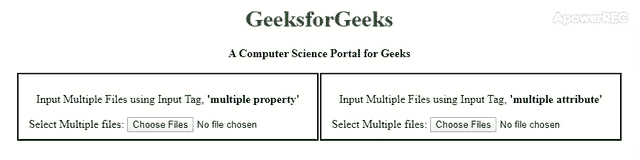

# 如何使用 HTML 输入标签选择多个文件？

> 原文:[https://www . geesforgeks . org/如何使用-html-input-tag/](https://www.geeksforgeeks.org/how-to-select-multiple-files-using-html-input-tag/) 选择多个文件

HTML 5 发布后，使用输入标签上传多个文件成为可能。由于我们中的许多人都在 HTML 上工作，并且仍然使用标签，例如 [**<【输入】>**](https://www.geeksforgeeks.org/html-input-tag/) 标签用于从用户处获取输入，以及 [**<表单>**](https://www.geeksforgeeks.org/html-form-tag/) 标签用于在我们的网站上使用表单，因此有必要知道如何使用 HTML 实现多文件功能。我们可以将**“多重”**属性赋值为多重，如下所示:

**语法:**

```html
<input type="file" id="files" name="files" multiple="multiple">
```

或

```html
<input type="file" id="files" name="files" multiple>
```

**注意:**我们可以只用倍数作为属性。嗯，很简单。HTML 5 的输入标签有一个属性是“多重”。
下面的例子说明了上面的方法:
**例子:**使用这个属性，可以输入多个文件。要选择文件，您必须使用 CTRL 或 SHIFT 键并选择要上传的文件数量。

## 超文本标记语言

```html
<!DOCTYPE html>
<html>

<head>
    <title>
        Select multiple files using HTML Input tag
    </title>
    <style>
        h1 {
            color: green;
        }

        .container {
            text-align: center;
            width: 850px;
            margin: 35px;
        }

        .property {
            width: 400px ;
            float: left;
            border: 2px solid black;
            padding: 10px;
        }
        .attribute {
            width: 400px ;
            float: right;
            border: 2px solid black;
            padding: 10px;
        }
    </style>
</head>

<body>
    <div class="container">
        <h1>GeeksforGeeks</h1>
        <b>A Computer Science Portal for Geeks</b>
        <br><br>
        <div class="property">

<p>
                Input Multiple Files using Input Tag,
                <b>'multiple property'</b>
            </p>

            <form action="/action_page_inputtags_multiplefiles.php">
                <label for="files">Select Multiple files:</label>
                <input type="file" id="files" name="files" multiple>
            </form>
        </div>
        <div class="attribute">

<p>
                Input Multiple Files using Input Tag,
                <b>'multiple attribute'</b>
            </p>

            <form action="/action_page_inputtags_multiplefiles.php">
                <label for="files">Select Multiple files:</label>
                <input type="file" id="files" name="files"
                                              multiple="multiple">
            </form>
        </div>
</body>

</html>
```

**输出:**



但是如果你使用的是 HTML 4 或者比 HTML 更低的版本，要么你需要使用多个输入标签，要么你可以使用 Flash 或者 Silverlight 这样的插件来插入多个输入文件。您也可以使用 JavaScript 上传多个文件。然而，不鼓励使用 HTML 4 和更低版本，因为 HTML 5 引入了许多新功能，并且使用第三方插件进行各种操作的依赖性大大降低。通过使用输入标签的多个属性，您可以上传多个文件。