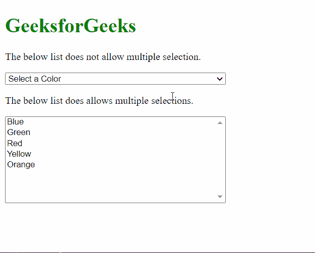
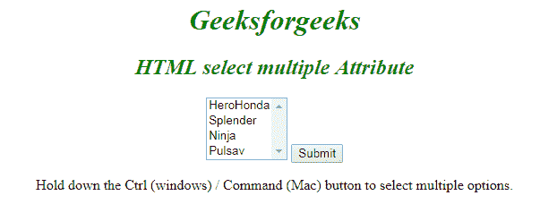

# 如何在 HTML5 的下拉列表中一次选择多个选项？

> 原文:[https://www . geesforgeks . org/如何选择多个选项一次下拉列表 html5/](https://www.geeksforgeeks.org/how-to-select-multiple-options-at-once-in-dropdown-list-in-html5/)

下拉列表是 HTML 中最灵活的元素之一。它类似于无线电输入，即默认情况下只能从一组项目中选择一个项目。但是，当**多个**属性与<选择>元素一起使用时，我们可以从列表中选择多个选项。 **[多个](https://www.geeksforgeeks.org/html-select-multiple-attribute/)** 属性是一个布尔属性，用于指定是否可以一次选择多个选项。

选择多个选项的过程因不同的操作系统和浏览器而异，如下所述:

*   **窗口**:我们需要按住 *CTRL* 按钮选择多个选项。
*   **Mac** :我们需要按住*命令*按钮选择多个选项。

请注意，由于处理这一问题的方式不同，并且必须通知用户有多个选项可用，因此使用复选框会更方便用户。

下面的例子演示了**多个**属性的使用:

**例 1:**

## 超文本标记语言

```html
<html>
<body>
  <h1 style="color: green;">
    GeeksforGeeks
  </h1>

<p>
    The below list does not allow 
    multiple selection.
  </p>

  <form id="form1">
    <select width=300 
            style="width: 350px">
      <option value='blue'>Blue</option>
      <option value='green'>Green</option>
      <option value='red'>Red</option>
      <option value='yellow'>Yellow</option>
      <option value='' selected>Select a Color</option>
    </select>
  </form>

<p>
    The below list does allows
    multiple selections.
  </p>

  <form id="form2">
    <select width=300 style="width: 350px"
            size="8" multiple>
      <option value='blue'>Blue</option>
      <option value='green'>Green</option>
      <option value='red'>Red</option>
      <option value='yellow'>Yellow</option>
      <option value='orange'>Orange</option>
    </select>
  </form>
</body>
</html>
```

**输出:**



**例 2:**

```html
<html>

<body>
    <center>
        <h1 style="color:green; font-style:italic;">
          Geeksforgeeks
      </h1>
        <h2 style="font-style:italic; color:green;">
          HTML select multiple Attribute
      </h2>
        <form action=" ">
            <select name="Bikes" multiple>
                <option value="HeroHonda">HeroHonda</option>
                <option value="Splender">Splender</option>
                <option value="Ninja">Ninja</option>
                <option value="Pulsav">Pulsav</option>
            </select>
            <input type="submit">
        </form>

        <p>Hold down the Ctrl (windows) / 
          Command (Mac) button to select multiple options.</p>
    </center>
</body>

</html>
```

**输出:**
