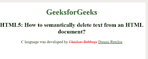

# 如何从 HTML 文档中语义删除文本？

> 原文:[https://www . geesforgeks . org/如何从 html 文档中语义删除文本/](https://www.geeksforgeeks.org/how-to-semantically-delete-text-from-an-html-document/)

本文的方法是学习如何通过使用文档中的 [< del >](https://www.geeksforgeeks.org/html-del-tag/) 元素从语义上删除 HTML 文档中的文本。此标签用于标记已从文档中删除的部分文本。

**语法**:

```html
<del> Contents... </del>
```

**示例:**

```html
<!DOCTYPE html>
<html>
    <body>
        <center>
            <h1 style="color: green;">
              GeeksforGeeks</h1>
            <h2>HTML5: How to semantically 
              delete text from an HTML document?</h2>
            <p>
                C language was developed by
                <del style="color: red;" 
                     datetime="2018-11-21T15:55:03Z">
                  Charleas Babbage</del>
                <ins style="color: green;">
                  Dennis Retchie</ins>
            </p>
        </center>
    </body>
</html>
```

**输出:**



**支持的浏览器:如下所示:**

*   谷歌 Chrome
*   微软公司出品的 web 浏览器
*   火狐浏览器
*   歌剧
*   旅行队