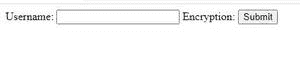

# 如何在 HTML5 中设置页面加载时自动聚焦的 keygen 元素？

> 原文:[https://www . geeksforgeeks . org/如何设置 html5 页面加载时自动获得焦点的 keygen 元素/](https://www.geeksforgeeks.org/how-to-set-a-keygen-element-that-automatically-get-focused-when-page-loads-in-html5/)

HTML 中的<keygen>标记用于指定表单中的密钥对生成器字段。这个元素的目的是提供一种安全的方法来验证用户。当提交表单时，会生成两个密钥，私钥和公钥。私钥存储在本地，公钥发送到服务器。公钥用于生成客户端证书，以便将来验证用户。

**语法**

```html
<keygen name = "anyname">
```

如果我们想要一个 keygen 元素在页面加载时自动获得焦点，那么我们可以使用<keygen>元素的自动对焦属性。自动对焦属性是一个布尔属性，当该属性存在时，它指定了<keygen>一个在页面加载时应该自动对焦的元素。

**语法:**

```html
<keygen autofocus>
```

## 超文本标记语言

```html
<!DOCTYPE html>
<html>

<body>
    <form action="mypage.php" method="get">
        Username: <input type="text" 
            name="user_name"> 
            Encryption: 
            <keygen name="security" autofocus>
        <input type="submit">
    </form>
</body>

</html>
```

**输出:**

