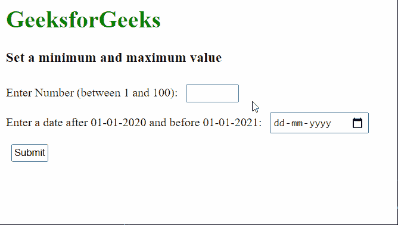

# 如何在 HTML5 中设置一个输入元素的最小值和最大值？

> 原文:[https://www . geesforgeks . org/如何为 html5 中的输入元素设置最小值和最大值/](https://www.geeksforgeeks.org/how-to-set-a-minimum-and-maximum-value-for-an-input-element-in-html5/)

在本文中，我们将学习如何使用 **HTML <输入> [min](https://www.geeksforgeeks.org/html-input-min-attribute/) 和 [max](https://www.geeksforgeeks.org/html-inputmax-attribute/) 属性来设置输入元素的最小值和最大值。**这防止输入元件接受低于最小值或高于最大值的值。

**方式:**这可以通过使用**最小值**和**最大值**属性来实现:

*   **min:** 该属性接受输入元素的最小值。
*   **最大值:**该属性接受输入元素的最小值。

这些参数一起可用于指定可接受作为输入的数字范围。请注意，这些属性仅适用于输入类型*编号*和*日期*。

**语法:**

```html
<input type="number" min="min_value" max="max_value">
```

**示例:**在这个示例中，我们使用了两个输入类型不同的输入，一个是数字类型，另一个是日期类型。数字的最小和最大范围是从 1 到 100，日期是从 2020 年 1 月 1 日到 2021 年 1 月 1 日。

## 超文本标记语言

```html
<html>
<head>
  <style type="text/css">
    label {
      font: 18px;
    }

    input {
      margin: 7px;
      padding: 2px
    }
  </style>
</head>
<body>
  <h1 style="color: green">
    GeeksforGeeks
  </h1>
  <h3>Set a minimum and maximum value</h3>
  <form>
    <label for="Number">
      Enter Number (between 1 and 100):
    </label>
    <input type="number" id="Number" 
           name="Number" min="1" max="100">
    <br>
    <label for="datemin">Enter a date after
      01-01-2020 and before 01-01-2021:
    </label>
    <input type="date" id="datemin" name="datemin"
           min="2020-01-01" max="2021-01-01">
    <br>
    <input type="submit">
  </form>
</body>
</html>
```

**输出:**

