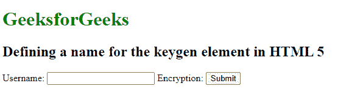

# 如何在 HTML5 中为 keygen 元素设置名称？

> 原文:[https://www . geesforgeks . org/如何在 html5 中为 keygen-element 设置名称/](https://www.geeksforgeeks.org/how-to-set-a-name-for-keygen-element-in-html5/)

在 HTML 中，<keygen>标记用于在表单中指定一个密钥对生成器字段，<keygen>名称属性用于设置密钥生成元素的名称。<keygen>元素的目的是通过认证用户来提供安全。当提交一个 from 时，会生成两个密钥，私钥和公钥。私钥存储在本地，因此公钥被发送到服务器。通用公钥用于生成客户端证书，以便将来验证用户。所以基本上它习惯于加密和解密数据。

**语法**

```html
<keygen name = "name">
```

**注意:**在 HTML5 中，keygen 是**不再支持。**

<keygen>标签的属性如下:

*   **名称:**指定 **<键根>** 元素的名称。
*   **自动对焦:**指定网页加载后对元素的对焦。
*   **禁用:**将元件设置为禁用。
*   **密钥类型:**指定用于密钥生成的算法类型。

**示例:**

## 超文本标记语言

```html
<!DOCTYPE html>
<html>

<body>
    <h1 style="color:green;">
        GeeksforGeeks
    </h1>

    <h2>
        Defining a name for the 
        keygen element in HTML 5
    </h2>

    <form>
        Username: <input type="text" name="uname">
        Encryption: <keygen name="security">
        <input type="submit">
    </form>
</body>

</html>
```

**输出:**

