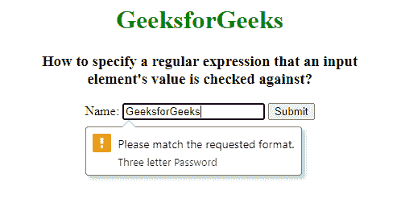

# 如何为使用 HTML 检查的输入元素值设置正则表达式？

> 原文:[https://www . geesforgeks . org/如何使用 html 设置输入元素值的正则表达式/](https://www.geeksforgeeks.org/how-to-set-a-regular-expression-for-an-input-element-value-that-checked-against-using-html/)

在本文中，我们将使用<input>模式属性为检查的输入字段设置正则表达式模式。HTML <input>模式属性用于指定用于检查输入元素值的正则表达式。该属性适用于以下输入类型:文本、密码、日期、搜索、电子邮件等。使用全局标题属性来描述帮助用户的模式。

**语法:**

```html
<input pattern = "regular_exp">
```

**属性值:**模式属性用于设置进入输入字段的正则表达式的模式。

**示例:**本示例说明了在<输入>元素时模式属性的使用。

## 超文本标记语言

```html
<!DOCTYPE html>
<html>

<head>
    <title>
        How to specify a regular expression
        that an input element's value
        is checked against?
    </title>
</head>

<body style="text-align: center;">
    <h1 style="color: green;">
        GeeksforGeeks
    </h1>

    <h3>
        How to specify a regular expression
        that an input <br>element's value
        is checked against?
    </h3>

    <form action="#">
        Name: <input type="text" name="Password"
            pattern="[A-Za-z]{10}" 
            title="Three letter Password">

        <input type="submit">
    </form>
</body>

</html>
```

**输出:**



**支持的浏览器:**HTML<输入>模式属性支持的浏览器如下:

*   谷歌 Chrome 5.0
*   Internet Explorer 10.0
*   Firefox 4.0
*   Safari 10.1
*   歌剧 9.6