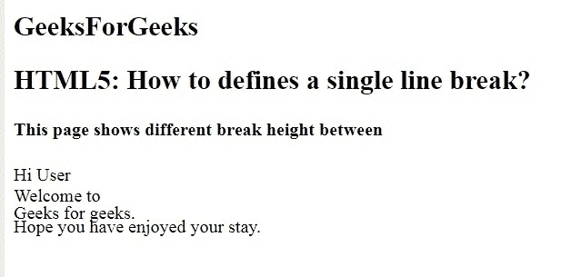

# 如何在 HTML5 中设置单行分隔线？

> 原文:[https://www . geeksforgeeks . org/如何设置单行闯入 html5/](https://www.geeksforgeeks.org/how-to-set-a-single-line-break-in-html5/)

在本文中，我们将使用 **[< br >标记](https://www.geeksforgeeks.org/html-br-tag/)** 来添加单行分隔符。它用来给单行换行。它是空标记，因此不包含结束标记。

**语法:**

```html
<br>
```

**例 1:** 本例使用< br >标签断线。

```html
<!DOCTYPE html>
<html>

<head>
    <title>
        How to defines a 
        single line break?
    </title>

    <style>
        body {
            text-align: center;
        }

        h1 {
            color: green;
        }
    </style>
</head>

<body>
    <h1>GeeksforGeeks</h1>

    <h2>
        HTML5: How to defines 
        a single line break?
    </h2>

    <!-- br tag is used here -->
    <p>
        GeeksforGeeks: <br> 
        Computer science portal
    </p>
</body>

</html>              
```

**输出:**


**例 2:** 本例使用 br 类断线。

```html
<!DOCTYPE html>
<html>

<head>
    <title>
        How to defines a 
        single line break?
    </title>

    <style type="text/css">
        .br {
            display: block;
            margin-bottom: 0em;
        }

        .brsmall {
            display: block;
            margin-bottom: -.2em;
        }

        .brxsmall {
            display: block;
            margin-bottom: -.4em;
        }
    </style>
</head>

<body>
    <h2>GeeksForGeeks</h2>

    <h2>
        HTML5: How to defines 
        a single line break?
    </h2>

    <h4>
        This page shows different
        break height between
    </h4>

    <p>Hi User
        <span class="br"></span>
        Welcome to
        <span class="brsmall"></span>
        Geeks for geeks.
        <span class="brxsmall"></span>
        Hope you have enjoyed your stay.
    </p>
</body>

</html>        
```

**输出:**
