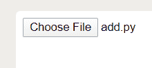

# 如何用 HTML 给输入文件设置一个值？

> 原文:[https://www . geesforgeks . org/如何使用 html 将值设置为输入文件/](https://www.geeksforgeeks.org/how-to-set-a-value-to-an-input-file-using-html/)

在 HTML 中，我们将使用类型属性在表单中接受输入，当我们必须将文件作为输入时，类型属性的文件值允许我们为文件上传定义一个元素。它在我们的计算机屏幕上显示一个浏览按钮，当我们点击这个浏览按钮时，它会请求用户允许从他的本地计算机上选择文件。

**基本语法:**

```html
<input type="file">
```

**示例:**

```html
<!DOCTYPE html>
<html>

<head></head>

<body>
    <form>
        <!--We tried to set the "file"
            value to attribute "type"-->
        <input type="file">
    </form>
</body>

</html>
```

**输出:**


但是当我们想默认接受文件输入时，我们就不能这样做。这意味着由于 HTML 中的一些安全原因，我们无法为文件输入设置值。

**示例:**

```html
<!DOCTYPE html>
<html>

<head></head>

<body>
    <form name="htmltest">
        <!--Here, by default we have tried
            to implement a file path using 
            the value attribute. But it 
            will not work here. -->
        <input type="file" value="c:/amrit.txt">
    </form>
</body>

</html>
<!--We can implement the submit 
    button using javascript. -->
<!--script>document.htmltest.submit();</script-->
```

上面的代码将给出与前面代码相同的输出，因为这里我们想要设置值，但是由于安全原因，它不起作用。因此，在 HTML 中，[是获取文件输入的唯一方法。](https://www.geeksforgeeks.org/html-input-typefile/)