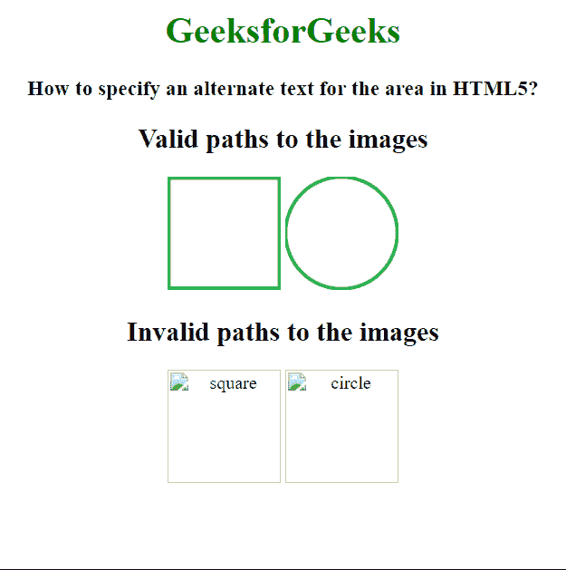

# 如何在 HTML5 中为区域设置替代文本？

> 原文:[https://www . geesforgeks . org/如何在 html5 中为区域设置替代文本/](https://www.geeksforgeeks.org/how-to-set-an-alternate-text-for-area-in-html5/)

在本文中，我们将学习如何在 HTML5 中为一个区域指定替代文本。由于各种原因，如屏幕阅读器的使用、 *src* 属性中的图像路径不正确或不存在，或者互联网连接缓慢，显示了该替代文本。

**进场:**我们将使用区域元素的 **alt 属性**。当元素本身无法显示时，它会提供有关图像或链接等元素的替代信息。无法查看元素可能有各种原因，例如资源路径可能已更改、资源不可用或互联网连接缓慢。

**语法:**

```html
<area alt="alternate text">
```

下面的例子演示了上述方法。

**示例:**在该示例中，提供了图像的正确和不正确路径，因此当指定了不正确的路径时，该区域的替代文本是可见的。

## 超文本标记语言

```html
<!DOCTYPE html>
<html>

<body style="text-align:center;">
    <h1 style="color:green;">
        GeeksforGeeks
    </h1>

    <h3>
        How to specify an alternate
        text for the area in HTML5?
    </h3>

    <h2>Valid paths to the images</h2>
    

    

    <h2>Invalid paths to the images</h2>
    

    

    <map name="square">
        <area shape="square" 
            coords="0,0,90,130" alt="square">
    </map>

    <map name="circle">
        <area shape="circle" 
            coords="100,60,5" alt="circle">
    </map>

    <map name="square2">
        <area shape="square" 
            coords="0,0,90,130" alt="square2">
    </map>

    <map name="circle2">
        <area shape="circle" 
            coords="100,60,5" alt="circle2">
    </map>
</body>

</html>
```

**输出:**

