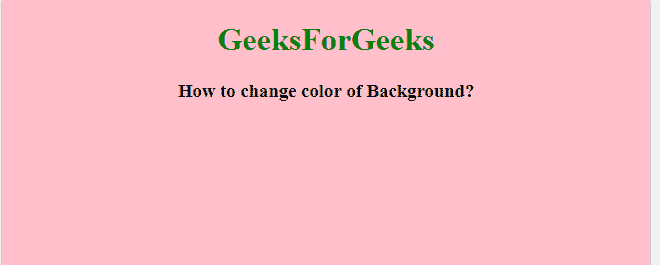
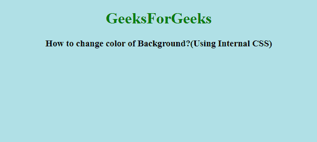

# 如何在 HTML 中设置背景色？

> 原文:[https://www . geesforgeks . org/如何设置 html 背景色/](https://www.geeksforgeeks.org/how-to-set-background-color-in-html/)

在本文中，我们将看到如何设置元素的背景颜色。使用*样式*属性的目的是给元素添加样式。对不同的元素使用样式属性只会导致该元素发生变化。该属性可以用作内联、内部或外部属性。style 属性提供了许多可以用来改进简单 html 页面的属性。

背景颜色可以通过三种方式更改:

*   内嵌样式属性
*   内部 CSS
*   外部 CSS

HTML5 不支持 *<正文>* 标签的“*bgcolor”*属性，因此我们需要使用内联样式属性和内部 CSS 选项来改变网页的颜色。对于内部 CSS，在 html 文件的开头添加 *<样式>* 标签，并添加正在应用更改的标签在这种情况下，使用<正文>标签。

**语法:**

```html
/* For inline style attribute */
<tag style="property:value">

/* For internal CSS attribute */
<style>
  tagName{
    property:value;
  }
</style>
```

**示例 1:** 下面是说明内联 CSS 使用的示例。

## 超文本标记语言

```html
<!DOCTYPE html>
<html>

<!--This line changes the color of background-->
<body style="background-color:pink">
    <h1 style="color:green;text-align:center;">
        GeeksForGeeks
    </h1>

    <h3 style="text-align:center;">
        How to change color of Background?
    </h3>
</body>

</html>
```

**输出:**在浏览器中打开 html 文件时会显示这个。



**示例 2:** 下面是说明内部 CSS 使用的示例。

## 超文本标记语言

```html
<!DOCTYPE html>
<html>

<head>
    <style>
        body {
            background-color: powderblue;
        }

        h1 {
            color: green;
            text-align: center;
        }

        h3 {
            text-align: center;
        }
    </style>
</head>

<body>
    <h1>GeeksForGeeks</h1>

    <h3>
        How to change color of
        Background?(Using Internal CSS)
    </h3>
</body>

</html>
```

**输出:**在浏览器中打开 html 文件时会显示



**外部 CSS:** 在外部 CSS 中，我们创建了一个单独的文件，其中包含了 html 文件的所有样式数据。将文件存储在外部可以更容易地将更改应用到 HTML 页面。