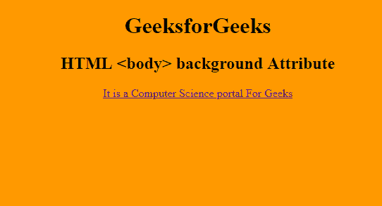

# 如何在 HTML 中设置背景图像？

> 原文:[https://www . geesforgeks . org/如何设置背景-html 中的图像/](https://www.geeksforgeeks.org/how-to-set-background-image-in-html/)

我们在一些网站上看到的背景图像不仅让它看起来很好，而且增强了用户体验。背景图像有可能告诉用户网站的主题，使用户坚持网站。示例:如果您在网站上添加了与旅行相关的背景图像，它会清楚地告诉用户关于网站的主题，用户将进一步探索它。就像当你给出一个背景图片时，它也会邀请你的用户去浏览一些其他的网页。

读完这篇文章后，你将能够只使用 **HTML 和 CSS** 在网页中设置背景图像。

在 HTML 文件中设置背景图像有两种方法:

1.  通过在 HTML 的标签中使用[背景属性](https://www.geeksforgeeks.org/html-body-background-attribute/)。
2.  通过使用内联或内部样式表。

**方法 1:** 利用 HTML 中标签的背景属性

**语法:**

```html
<body background = "image_name.extension">
```

**属性值:**保存你想作为背景图像的图像文件。

**注意:** HTML 5 不支持<正文>标签中的背景属性，只好用 CSS 将背景图片添加到网页中。

**示例:**

```html
<!DOCTYPE html>
<html>

<head>
    <title>
        HTML body Background Attribute
    </title>
</head>

<!-- body tag starts here -->
<body background=
"https://media.geeksforgeeks.org/wp-content/uploads/rk.png">

    <center>
        <h1>GeeksforGeeks</h1>
        <h2>HTML <body> background Attribute</h2>

        <a href="#">
            It is a Computer Science portal For Geeks
        </a>
    </center>
</body>
<!-- body tag ends here -->

</html>
```

**输出:**


**方法二:**通过使用内联或内部样式表，这里我们必须使用 HTML 的[样式属性](https://www.geeksforgeeks.org/html-style-attribute/)和 CSS 的[背景图像属性](https://www.geeksforgeeks.org/css-background-image-property/)。

**语法:**

```html
<div style = "background-image: url('Image_name.extension');">
```

## 超文本标记语言

```html
<!DOCTYPE html>
<html>

<head>
    <title> By using Inline CSS</title>
</head>

<body style="background-image: url('image.png');">
    <h2>Welcome To GFG</h2>
</body>

</html>
```

**输出:**

