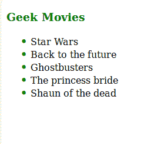
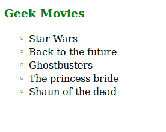
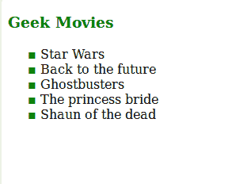

# 如何只用 CSS 设置 HTML 列表中的项目符号颜色？

> 原文:[https://www . geesforgeks . org/如何设置 html 列表中的项目符号颜色-仅使用 css/](https://www.geeksforgeeks.org/how-to-set-bullet-colors-in-html-lists-using-only-css/)

给定一个无序的项目符号列表(UL)，我们需要使用 CSS 改变列表中项目符号的颜色。

**注意**:不允许使用任何图像或跨度标签。

首先，CSS 中没有直接的方法可以改变无序列表中项目符号的颜色。但是，要使用 CSS 更改无序列表中项目符号的颜色，我们必须首先放弃默认的列表样式，并手动定义列表中每个列表项之前的**中的**内容**。**

此内容是您要用于列表的项目符号类型的 Unicode。不同项目符号样式的 Unicode 字符如下:

*   **广场** : `"\25AA"`
*   **圆圈** : `"\2022"`
*   **光盘** : `"\2022"`

下面是一个示例 CSS 代码，它删除了 HTML 中无序列表的默认样式，并使用了 unicodes:

```html
ul{
    /* Remove default bullets */
    list-style: none; 
}

ul li::before {

   /* Add Unicode of the bullet */
   content: ;  

   /* Color of the content -- bullet here */
   color: green; 

   /* Required to add space between 
        the bullet and the text */
   display: inline-block; 

   /* Required to add space between
        the bullet and the text */
   width: 1em; 

   /* Required to add space between the
        bullet and the text */
   margin-left: -0.9em; 
}
```

下面的程序说明了改变列表项项目符号颜色的上述方法:

**例 1** :

```html
<html>
   <head>
        <title>Changing Bullet Colors</title>

        <style>
            h3{
                color:green;
            }

            ul{
                list-style: none;
            }

            ul li::before {

                /* \2022 is the CSS Code/unicode for a disc */
                content: "\2022";  
                color: green; 
                display: inline-block; 
                width: 1em;
                margin-left: -0.9em;
                font-weight: bold;
                font-size:1.1rem;
            }
        </style>
  </head>

  <body>

    <h3>Geek Movies</h3>

    <!-- Create an Unordered List -->
    <ul>
        <li>Star Wars</li>
        <li>Back to the future</li>
        <li>Ghostbusters</li>
        <li>The princess bride</li>
        <li>Shaun of the dead</li>
    </ul>

  </body>

</html>
```

**输出:**


**例 2:**

```html
<html>
   <head>
        <title>Changing Bullet Colors</title>

        <style>
            h3{
                color:green;
            }

            ul{
                list-style: none;
            }

            ul li::before {

                /*\25E6 is the CSS Code/unicode for a circle */
                content: "\25E6";  
                color: green; 
                display: inline-block; 
                width: 1em;
                margin-left: -0.9em;
                font-weight: bold;
                font-size:1.1rem;
            }
        </style>
  </head>

  <body>

    <h3>Geek Movies</h3>

    <!-- Create an Unordered List -->
    <ul>
        <li>Star Wars</li>
        <li>Back to the future</li>
        <li>Ghostbusters</li>
        <li>The princess bride</li>
        <li>Shaun of the dead</li>
    </ul>

  </body>

</html>
```

**输出:**


**例 3:**

```html
<html>
   <head>
        <title>Changing Bullet Colors</title>

        <style>
            h3{
                color:green;
            }

            ul{
                list-style: none;
            }

            ul li::before {

                /* \25AA is the CSS Code/unicode for a square */
                content: "\25AA";  
                color: green; 
                display: inline-block; 
                width: 1em;
                margin-left: -0.9em;
                font-weight: bold;
                font-size:1.1rem;
            }
        </style>
  </head>

  <body>

    <h3>Geek Movies</h3>

    <!-- Create an Unordered List -->
    <ul>
        <li>Star Wars</li>
        <li>Back to the future</li>
        <li>Ghostbusters</li>
        <li>The princess bride</li>
        <li>Shaun of the dead</li>
    </ul>

  </body>

</html>
```

**输出:**
