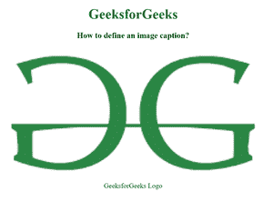

# 如何使用 HTML 为图像设置标题？

> 原文:[https://www . geesforgeks . org/如何使用 html 为图像设置标题/](https://www.geeksforgeeks.org/how-to-set-caption-for-an-image-using-html/)

HTML 中的<figurecaption>标记用于为文档中的图形元素设置标题。这个标签在 HTML5 中是新的。</figurecaption>

**语法:**

```html
<figcaption> Figure caption... </figcaption>

```

**例 1:**

## 超文本标记语言

```html
<!DOCTYPE html>
<html>

<head>
    <style>
        body {
            text-align: center;
        }

        h1 {
            color: green;
        }
    </style>
</head>

<body>
    <h1>GeeksforGeeks</h1>

    <h3>
        How to define an image caption?
    </h3>

    <figure>
        

        <figcaption>GeeksforGeeks Logo</figcaption>
    </figure>
</body>

</html>
```

**输出:**

