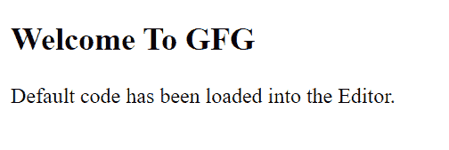

# 如何在 HTML5 中设置文档的字符编码？

> 原文:[https://www . geesforgeks . org/如何设置 html5 中文档的字符编码/](https://www.geeksforgeeks.org/how-to-set-character-encoding-for-document-in-html5/)

字符编码是定义字节和文本之间映射的一种方法。为了正确显示一个 HTML 文档，我们必须选择一个合适的字符编码。

不同类型的字符编码包括:

*   **ASCII 字符集:**它是有史以来第一个字符编码标准。ASCII 的主要缺点是它只包含有限的字符范围(128 个字符)。
*   **ANSI 字符集:**该标准是标准 ASCII 字符集的扩展版本。它支持 256 个字符。
*   **ISO-8859-1 字符集:**是 HTML 2.0 中默认的字符编码。它也是带有国际字符的 ASCII 标准的扩展。这使用全字节(8 位)来显示字符。
*   **UTF-8 字符集:**这个标准几乎涵盖了世界上所有的字符和符号。UTF-8 字符集满足了 ANSI 和 ISO-8859-1 的限制。HTML5 的默认字符编码是 UTF-8。

HTML5 规范鼓励开发人员使用 UTF-8 字符集。

在 UTF 8 编码标准中，一个字符可以有 1-4 个字节长。这也是电子邮件和网页最喜欢的编码方式。

*   字符编码可以在 HTML 的元标签中指定。
*   元标签用于指定关于网页的元数据，不会显示在网页中。
*   元标签帮助搜索引擎理解网页是关于什么的。
*   元标签应该和头部标签放在一起。

**语法:**

**1。对于 HTML4**

```html
<meta http-equiv="Content-Type" content="text/html;charset=UTF-8"> 
```

**2。对于 HTML5**

HTML5 的默认字符编码是 UTF-8，但您仍然可以指定这一点以格外小心。

```html
<meta charset="UTF-8">  
```

**示例:**

## 超文本标记语言

```html
<!DOCTYPE html>
<html>

<head>
    <!-- NOTE: <meta charset="UTF-8"> 
        is also applicable. -->
    <meta charset="utf-8">
    <title>Page Title</title>
</head>

<body>
    <h2>Welcome To GFG</h2>

    <p>
        Default code has been loaded 
        into the Editor.
    </p>
</body>

</html>
```

**Output:**
