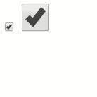
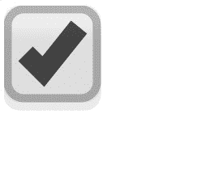

# 如何在 HTML/CSS 中设置复选框大小？

> 原文:[https://www . geesforgeks . org/how-set-checkbox-size-in-html-CSS/](https://www.geeksforgeeks.org/how-to-set-checkbox-size-in-html-css/)

复选框是一个 HTML 元素，用于接受用户的输入。
**方法 1:** 可以使用高度和宽度属性设置复选框的大小。高度属性设置复选框的高度，宽度属性设置复选框的宽度。

**语法:**

```html
input./*checkbox class name*/ {
    width : /*desired width*/;
    height : /*desired height*/;
}

```

**示例:**

```html
<!DOCTYPE html> 
<html>

<head>
    <title>
        Set checkbox size
    </title>

    <!-- Style to set the size of checkbox -->
    <style>
        input.largerCheckbox {
            width: 40px;
            height: 40px;
        }
    </style>
</head>

<body> 
    <input type="checkbox" class="defaultCheckbox"
            name="checkBox1" checked>

    <input type="checkbox" class="largerCheckbox"
            name="checkBox2" checked>
</body>

</html>                    
```

**输出:**


**注意:**这对于谷歌 Chrome、微软 Edge 和 Internet Explorer 都很好用。在 Mozilla Firefox 中，可点击的复选框区域是指定的，但它显示默认大小的复选框。

**方法 2:** 一个同样适用于 Mozilla Firefox 的替代解决方案是使用**变换**属性。

**语法:**

```html
input./*checkbox class name*/ {
    transform : scale(/*desired magnification*/);
}

```

**示例:**

```html
<!DOCTYPE html> 
<html>

<head>
    <title>
        Set the size of checkbox
    </title>

    <!-- Use transform scale property to 
        set size of checkbox -->
    <style>
        input.largerCheckbox {
            transform : scale(10);
        }
        body {
            text-align:center;
            margin-top:100px;
        }
    </style>
</head>

<body>
    <input type="checkbox" class="largerCheckbox"
            name="checkBox2" checked>
</body>

</html>
```

**输出:**

这种方法有几个弊端。该复选框必须小心放置，以将其保留在浏览器窗口中，或防止其与其他元素重叠。此外，在某些浏览器中，对于较大的尺寸，复选框可能会显示为像素化。

HTML 是网页的基础，通过构建网站和网络应用程序用于网页开发。您可以通过以下 [HTML 教程](https://www.geeksforgeeks.org/html-tutorials/)和 [HTML 示例](https://www.geeksforgeeks.org/html-examples/)从头开始学习 HTML。

CSS 是网页的基础，通过设计网站和网络应用程序用于网页开发。你可以通过以下 [CSS 教程](https://www.geeksforgeeks.org/css-tutorials/)和 [CSS 示例](https://www.geeksforgeeks.org/css-examples/)从头开始学习 CSS。