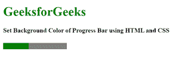
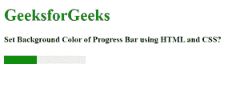

# 如何使用 HTML 和 CSS 设置进度条的颜色？

> 原文:[https://www . geesforgeks . org/如何使用 html 和 css 设置进度条颜色/](https://www.geeksforgeeks.org/how-to-set-color-of-progress-bar-using-html-and-css/)

进度条是网页上的一个重要元素，进度条可以用来下载、获取分数、技能衡量单位等。为了创建一个进度条，我们可以使用 HTML 和 CSS。

进度条用于表示任务的进度。它还定义了完成了多少工作，还有多少剩余来下载一个东西。它不用于表示磁盘空间或相关查询。

**示例 1:** 在本例中，我们将设置进度条的颜色。

## 超文本标记语言

```html
<!DOCTYPE html>
<html>

<head>
    <title>
        How to Set Background Color of
        Progress Bar using HTML and CSS?
    </title>
    <style>

        /* For Firefox */
        progress::-moz-progress-bar {
            background: green;
        }

        /* For Chrome or Safari */
        progress::-webkit-progress-value {
            background: green;
        }

        /* For IE10 */
        progress {
            background: green;
        }
    </style>
</head>

<body>
    <h1 style="color:green;">
        GeeksforGeeks
    </h1>

    <h4>
        Set Background Color of Progress
        Bar using HTML and CSS
    </h4>

    <progress value="40" max="100"></progress>
</body>

</html>
```

**输出:**



**示例 2:** 在本例中，我们将设置进度条的颜色和背景色。

## 超文本标记语言

```html
<!DOCTYPE html>
<html>

<head>
    <title>
        How to Set Background Color of
        Progress Bar using HTML and CSS?
    </title>
    <style>

        /* For Chrome or Safari */
        progress::-webkit-progress-bar {
            background-color: #eeeeee;
        }

        progress::-webkit-progress-value {
            background-color: #039603 !important;
        }

        /* For Firefox */
        progress {
            background-color: #eee;
        }

        progress::-moz-progress-bar {
            background-color: #039603 !important;
        }

        /* For IE10 */
        progress {
            background-color: #eee;
        }

        progress {
            background-color: #039603;
        }
    </style>
</head>

<body>
    <h1 style="color:green;">
        GeeksforGeeks
    </h1>

    <h4>
        Set Background Color of Progress
        Bar using HTML and CSS?
    </h4>

    <progress value="40" max="100"></progress>
</body>

</html>
```

**输出:**

