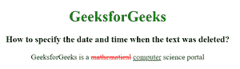

# 如何使用 HTML 设置文本被删除的日期和时间？

> 原文:[https://www . geesforgeks . org/如何使用 html 设置删除文本的日期和时间/](https://www.geeksforgeeks.org/how-to-set-date-and-time-when-the-text-was-deleted-using-html/)

HTML 中的~~标记代表删除，用于标记已经从文档中删除的部分文本。网页浏览器会将删除的文字呈现为删除线文字，不过这个属性可以使用 CSS 文字装饰属性来变更。~~标签需要一个开始和结束标签。~~~~

~~日期时间属性用于指定删除文本的日期和时间。~~

**语法:**

```html
<del datetime=""> Contents... </del>
```

**属性值:**该属性包含单值 YYYY-MM-DDThh:mm:ssTZD，用于指定删除文本的日期和时间。

日期时间组件的解释如下:

*   YYYY:设置日期时间对象的年份(如 2009 年)。
*   MM:它设置日期时间对象的月份(例如 05 代表三月)。
*   DD:它设置日期时间对象的月份(例如 04)。
*   这是必需的分隔符。
*   hh:它设置日期时间对象的小时(例如 06.00pm 的 18)。
*   mm:它设置 datetime 对象的分钟数(例如 34)。
*   ss:它设置日期时间对象的秒数(例如 40)。
*   TZD:时区指示器(Z 表示祖鲁语，也称为格林威治标准时间)

**示例:**

## 超文本标记语言

```html
<!DOCTYPE html>
<html>

<head>
    <title>
        How to specify the date and time
        when the text was deleted?
    </title>

    <style>
        del {
            color: red;
        }

        ins {
            color: green;
        }
    </style>
</head>

<body style="text-align:center">

    <h1 style="color:green;">
        GeeksforGeeks
    </h1>

    <h3>
        How to specify the date and time
        when the text was deleted?
    </h3>

<p>
        GeeksforGeeks is a <del
        datetime="2018-11-21T15:55:03Z">
        mathematical</del> <ins>computer</ins>
        science portal
    </p>

</body>

</html>
```

**输出:**



**支持的浏览器:**

*   谷歌 Chrome
*   微软公司出品的 web 浏览器
*   火狐浏览器
*   歌剧
*   旅行队