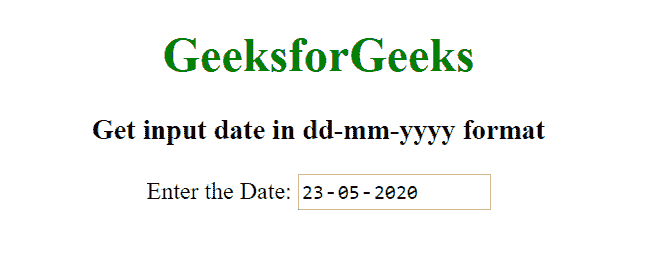

# 如何用 HTML 设置 dd-mm-yyyy 格式的输入类型日期？

> 原文:[https://www . geesforgeks . org/how-set-input-type-date-in-DD-mm-yyyy-format-using-html/](https://www.geeksforgeeks.org/how-to-set-input-type-date-in-dd-mm-yyyy-format-using-html/)

要设置和获取输入类型日期为 dd-mm-yyyy 格式，我们将使用 [<输入>类型属性](https://www.geeksforgeeks.org/html-input-typedate/)。<输入>类型属性用于定义日期选择器或控制字段。在此属性中，您可以设置从年月日到年月日的选择范围。如果未设置最小值和最大值，则默认最小值设置为“01-01-1920”，默认最大值设置为“01-01-2120”。

**示例 1:** 本示例使用<输入 type="date" >属性获取 dd-mm-yyyy 格式的日期。

```html
<!DOCTYPE html>
<html>

<head>
    <title>
        How to get input type date
        in dd-mm-yyyy format ?
    </title>

    <style>
        body {
            text-align: center;
        }
        h1 {
            color: green;
        }
    </style>
</head>

<body>
    <h1>GeeksforGeeks</h1>

    <h3>
        Get input date in
        dd-mm-yyyy format
    </h3>

    <label for="start">
        Enter the Date:
    </label>

    <input type="date" name="begin" 
        placeholder="dd-mm-yyyy" value=""
        min="1997-01-01" max="2030-12-31">
</body>

</html>
```

**输出:**


**示例 2:** 本示例使用<输入 type="date" >属性获取 dd-mm-yyyy 格式的日期。

```html
<!DOCTYPE html>
<html>

<head>
    <title>
        How to get input type date
        in dd-mm-yyyy format ?
    </title>

    <style>
        body {
            text-align: center;
        }
        h1 {
            color: green;
        }
    </style>
</head>

<body>
    <h1>GeeksforGeeks</h1>

    <h3>
        Get input date in
        dd-mm-yyyy format
    </h3>

    <label for="Date of Birth">
        Enter the Date:
        <input type="date" name="date">
    </label>
</body>

</html>
```

**输出:**


HTML 是网页的基础，通过构建网站和网络应用程序用于网页开发。您可以通过以下 [HTML 教程](https://www.geeksforgeeks.org/html-tutorials/)和 [HTML 示例](https://www.geeksforgeeks.org/html-examples/)从头开始学习 HTML。