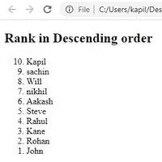
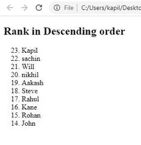

# 如何在 HTML5 中按降序设置列表？

> 原文:[https://www . geesforgeks . org/如何按 html5 降序排列列表/](https://www.geeksforgeeks.org/how-to-set-list-in-descending-order-in-html5/)

HTML 列表用于创建信息列表。任何列表都将有一个或多个列表项。我们有三种类型的列表。

*   **[ul](https://www.geeksforgeeks.org/html-ul-tag/) :** 无序列表被称为 ul。简单的项目符号将用于列出项目。
*   **[ol:](https://www.geeksforgeeks.org/html-ol-tag/)** 按一定顺序排列的数字。这将使用各种编号方案列出项目。
*   **[dl:](https://www.geeksforgeeks.org/html-dl-tag/)** 一个定义列表。这就把事情按照字典里的顺序排列了。

要设置有序列表中列表项的反向顺序，我们可以在 HTML 中使用< ol >元素的[反向](https://www.geeksforgeeks.org/html-reversed-attribute/)属性。它是在 HTML5 中引入的，并以降序显示编号。

**语法:**

```html
<ol reversed>
  <li>ListName</li>
 </ol>
```

**例 1:**

## 超文本标记语言

```html
<!DOCTYPE html>
<html>

<body>
  <h2>Rank in Descending order</h2>
  <ol reversed>
    <li>Kapil</li>
    <li>sachin</li>
    <li>Will</li>
    <li>nikhil</li>
    <li>Aakash</li>
    <li>Steve</li>
    <li>Rahul</li>
    <li>Kane</li>
    <li>Rohan</li>
    <li>John</li>
  </ol>
</body>

</html>
```

**输出:**



**示例 2:** 使用 start 属性，可以指定希望列表从哪个数字开始。

## 超文本标记语言

```html
<!DOCTYPE html>
<html>

<body>
  <h2>Rank in Descending order</h2>
  <ol reversed start = 23>
    <li>Kapil</li>
    <li>sachin</li>
    <li>Will</li>
    <li>nikhil</li>
    <li>Aakash</li>
    <li>Steve</li>
    <li>Rahul</li>
    <li>Kane</li>
    <li>Rohan</li>
    <li>John</li>
  </ol>
</body>

</html>
```

**输出:**

