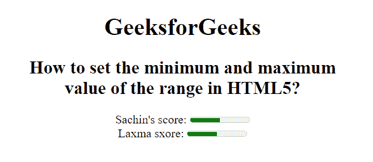

# 如何在 HTML5 中设置范围的最小值和最大值？

> 原文:[https://www . geesforgeks . org/如何在 html5 中设置范围的最小值和最大值/](https://www.geeksforgeeks.org/how-to-set-minimum-and-maximum-value-of-range-in-html5/)

在这篇文章中。我们将使用 **[<米>](https://www.geeksforgeeks.org/html5-meter-tag/)** 元素中的 **min** 和 **max** 属性来设置 HTML5 中范围的最小值和最大值。

**方法:**这可以通过使用最小和最大属性来实现:

*   **min:** 此属性用于指定仪表的下限。最小值属性的值总是小于最大值属性。它的默认值为 0。
*   **max:** 此属性用于指定仪表的上限。max 属性的值必须大于 min 属性。它的默认值是 1。

**语法:**

```html
<meter min="number" max="number">
```

**示例:**

## 超文本标记语言

```html
<!DOCTYPE html>
<html>

<body style="text-align:center;">
    <h1>GeeksforGeeks</h1>

    <h2>
        How to set the minimum and 
        maximum<br>value of the range 
        in HTML5?
    </h2> 

    Sachin's score:
    <meter value="5" min="0"
        max="10" high="6">
        5 out of 10
    </meter>

    <br>Laxma sxore:
    <meter value="0.5" max="1.0" 
        min="0" high="0.6">
        50% from 100%
    </meter>
</body>

</html>
```

**输出:**

